<div style="padding:10px; margin:0;font-family:newtimeroman;font-size:300%;text-align:center;border-radius: 30px 10px;overflow:hidden;font-weight:700;background-color:#272643; color:white">
    Blood Cell Cancer By Pytorch

<div style="text-align:center;">
    

<div style = 'border-radius: 10px; box-shadow: 0 2px 4px 0 rgba(0, 0, 0, 0.1);border:2px solid #90e0ef; background-color:##e3f6f5 ; ;padding:10px; font-size:130%'>
<p style="font-size:150%; font-weight:bold">About Dataset</p>

<p>The definitive diagnosis of Acute Lymphoblastic Leukemia (ALL), as a highly prevalent cancer, requires invasive, expensive, and time-consuming diagnostic tests. ALL diagnosis using peripheral blood smear (PBS) images plays a vital role in the initial screening of cancer from non-cancer cases. The examination of these PBS images by laboratory users is riddled with problems such as diagnostic error because the non-specific nature of ALL signs and symptoms often leads to misdiagnosis.</p>

<p>The images of this dataset were prepared in the bone marrow laboratory of Taleqani Hospital (Tehran, Iran). This dataset consisted of 3242 PBS images from 89 patients suspected of ALL, whose blood samples were prepared and stained by skilled laboratory staff. This dataset is divided into two classes benign and malignant. The former comprises hematogenous, and the latter is the ALL group with three subtypes of malignant lymphoblasts: Early Pre-B, Pre-B, and Pro-B ALL. All the images were taken by using a Zeiss camera in a microscope with a 100x magnification and saved as JPG files. A specialist using the flow cytometry tool made the definitive determination of the types and subtypes of these cells.

<a id='tbl_content'></a>
<div style="background-color:#eef1fb; padding: 20px 10px 10px 10px; border-radius: 10px; box-shadow: 2px 2px 4px 0 rgba(0, 0, 0, 0.1)">
    <ul>
        <li><a href="#setup" style="font-size:24px; font-family:calibri; font-weight:bold"> Step 1 | Setup </a></li>
            <ul>
                <li><a href="#step11" style="font-size:18px; font-family:calibri"> Step 1.1 | Install required libraries </a></li>
                <li><a href="#step12" style="font-size:18px; font-family:calibri"> Step 1.2 | Import required Libraries </a></li>
                <li><a href="#step13" style="font-size:18px; font-family:calibri"> Step 1.3 | Configurations </a></li>
                <li><a href="#step14" style="font-size:18px; font-family:calibri"> Step 1.4 | Device </a></li>
            </ul>
        <li><a href="#data" style="font-size:24px; font-family:calibri; font-weight:bold"> Step 2 | Data </a></li>
            <ul>
                <li><a href="#step21" style="font-size:18px; font-family:calibri" > Step 2.1 | Read Data </a></li>
                <li><a href="#step22" style="font-size:18px; font-family:calibri" > Step 2.2 | Copy images to working dir </a></li>
                <li><a href="#step23" style="font-size:18px; font-family:calibri" > Step 2.3 | Count Plot </a></li>
                <li><a href="#step24" style="font-size:18px; font-family:calibri" > Step 2.4 | Plot Images </a></li>
                <li><a href="#step25" style="font-size:18px; font-family:calibri" > Step 2.5 | Split images to Train-Valid-test folders </a></li>
            </ul> 
        <li><a href="#aug" style="font-size:24px; font-family:calibri; font-weight:bold"> Step 3 | DATA AUGMENTATIONS </a></li>
            <ul>
                <li><a href="#step31" style="font-size:18px; font-family:calibri"> Step 3.1 | Blure </li>
                <li><a href="#step32" style="font-size:18px; font-family:calibri"> Step 3.2 | Noise </li>
                <li><a href="#step33" style="font-size:18px; font-family:calibri"> Step 3.3 | Flip </li>
                <li><a href="#step34" style="font-size:18px; font-family:calibri"> Step 3.3 | Apply Augmantations </li>
            </ul>
        <li><a href="#dataset" style="font-size:24px; font-family:calibri; font-weight:bold"> Step 4 | DataSets and DataLoaders </a></li>
            <ul>
                <li><a href="#step41" style="font-size:18px; font-family:calibri"> Step 4.1 | Create Datasets and DataLoaders </a></li>
                <li><a href="#step42" style="font-size:18px; font-family:calibri"> Step 4.2 | Data Shapes </a></li>
                <li><a href="#step43" style="font-size:18px; font-family:calibri"> Step 4.3 | Model Compile </a></li>
                <li><a href="#step43" style="font-size:18px; font-family:calibri"> Step 4.3 | Model Training </a></li>
                <li><a href="#step44" style="font-size:18px; font-family:calibri"> Step 4.4 | Training Result </a></li>
                <li><a href="#step45" style="font-size:18px; font-family:calibri"> Step 4.5 | Evaluation </a></li>
            </ul>
        <li><a href="#free" style="font-size:24px; font-family:calibri; font-weight:bold"> Step 5 | FreeUp some space in RAM and GPU </a></li>
            <ul>
                <li><a href="#step41" style="font-size:18px; font-family:calibri"> Step 5.1 | RAM </a></li>
                <li><a href="#step42" style="font-size:18px; font-family:calibri"> Step 5.2 | GPU </a></li>
            </ul>
        <li><a href="#model" style="font-size:24px; font-family:calibri; font-weight:bold"> Step 6 | Model </a></li>
            <ul>
                <li><a href="#step41" style="font-size:18px; font-family:calibri"> Step 6.1 | PreTrained Model </a></li>
                <li><a href="#step42" style="font-size:18px; font-family:calibri"> Step 6.2 | Change Last Layer (fc) </a></li>
                <li><a href="#step43" style="font-size:18px; font-family:calibri"> Step 6.3 | Train the Model </a></li>
                <li><a href="#step43" style="font-size:18px; font-family:calibri"> Step 6.4 | Evaluation </a></li>
                <li><a href="#step44" style="font-size:18px; font-family:calibri"> Step 6.5 | Plot The Result </a></li>
                <li><a href="#step45" style="font-size:18px; font-family:calibri"> Step 6.6 | Confusion Matrix </a></li>
            </ul>
        <li><a href="#author" style="font-size:24px; font-family:calibri; font-weight:bold"> Author </a></li>
    </ul>

</div>

# <a id='setup'></a> 
# <span style="background-color:#1d3461;background-size: cover;font-family:tahoma;font-size:180%;text-align:center;border-radius:15px 15px; padding:10px; border:solid 2px #09375b"><span style="color:red"><b> 1 | </b></span><span style="color:#ade8f4"><b> SETUP

###### 🏠 [Tabel of Contents](#tbl_content)

## <a id='step11'></a>
## <span style="background-color:orange ;background-size: cover;font-family:tahoma;font-size:70%; font-weight: 900; text-align:left;border-radius:25px 25px; padding:10px; border:solid 2px #09375b"><span style="color:navy">1.1 | Install required libraries

<div style="background-color:#fbf8cc; padding: 10px 10px 10px 10px; border-radius: 10px; box-shadow: 2px 2px 4px 0 rgba(0, 0, 0, 0.1);border:0px solid #0A2342; text-align:left">
    <p style="font-size:16px; font-family:tahoma; line-height: 2em; text-indent: 20px;">🔵 At the first step, Install requred python librasries with <code>pip install</code> command.


```python
# ! pip install -q split-folders
```

## <a id='step12'></a>
## <span style="background-color:orange ;background-size: cover;font-family:tahoma;font-size:70%; font-weight: 900; text-align:left;border-radius:25px 25px; padding:10px; border:solid 2px #09375b"><span style="color:navy">1.2 | Import required Libraries

<div style="background-color:#fbf8cc; padding: 10px 10px 10px 10px; border-radius: 10px; box-shadow: 2px 2px 4px 0 rgba(0, 0, 0, 0.1);border:0px solid #0A2342; text-align:left">
    <p style="font-size:16px; font-family:tahoma; line-height: 2em; text-indent: 20px;">🔵 Then import nesseccary libraries with <code>import</code> command.


```python
import os                                                       # To work with main operating system commands
import gc                                                       # Its a 'Garbage collector' , to freeup spaces
import shutil                                                   # To copy and move files
import numpy as np                                              # To work with arrays
import cv2                                                      # Powerfull library to work with images
import random                                                   # To generate random number and random choices
import matplotlib.pyplot as plt                                 # To visualization
import seaborn as sns                                           # To visualization
import splitfolders                                             # To splite images to [train, validation, test]
from PIL import Image                                           # To read images
from tqdm.notebook import tqdm                                  # Beautifull progress-bar
from termcolor import colored                                   # To colorfull output
from warnings import filterwarnings                             # to avoid python warnings

import torch                                                   # Pytorch framework
import torchvision.transforms as transforms                    # to apply some  functions befor create a dataset
from torchvision.datasets import ImageFolder                   # To create dataset from images on local drive
from torch.utils.data import DataLoader                        # Create DataLoader
from torchvision.models import googlenet, GoogLeNet_Weights    # Pre-trained model with its weights
import torch.nn as nn                                          # Neural-Networs function
from datetime import datetime                                  # To calculate time and duration
from sklearn.metrics import confusion_matrix, classification_report     # To calculate and plot Confusion Matrix
```

## <a id='step13'></a>
## <span style="background-color:orange ;background-size: cover;font-family:tahoma;font-size:70%; font-weight: 900; text-align:left;border-radius:25px 25px; padding:10px; border:solid 2px #09375b"><span style="color:navy">1.3 | Configurations

<div style="background-color:#fbf8cc; padding: 10px 10px 10px 10px; border-radius: 10px; box-shadow: 2px 2px 4px 0 rgba(0, 0, 0, 0.1);border:0px solid #0A2342; text-align:left">
    <p style="font-size:16px; font-family:tahoma; line-height: 2em; text-indent: 20px;">🔵 Apply above libraries configs to better performances.


```python
# Add a style to seaborn plots for better visualization
sns.set_style('darkgrid')

# To avoide Python warniongs
filterwarnings('ignore')
```


```python
# Initialization values 

img_size = (128, 128)

batch_size = 64

num_epochs = 30
```


```python
# Show all colors used in this notebook
colors_dark = ['#1d3461', '#eef1fb', '#ade8f4', 'red', 'black', 'orange', 'navy', '#fbf8cc']

sns.palplot(colors_dark)
```


    

    


## <a id='step14'></a>
## <span style="background-color:orange ;background-size: cover;font-family:tahoma;font-size:70%; font-weight: 900; text-align:left;border-radius:25px 25px; padding:10px; border:solid 2px #09375b"><span style="color:navy">1.4 | Device


```python
device = torch.device('cuda:0' if torch.cuda.is_available() else 'cpu')

if device.type == 'cuda' :
    print(colored(' GPU is available ', 'green', 'on_white', attrs=['bold']))
else :
    print(colored(' You are using CPU ', 'red', 'on_white', attrs=['bold']))
```

     GPU is available 
    

# <a id='data'></a> 
# <span style="background-color:#1d3461;background-size: cover;font-family:tahoma;font-size:180%;text-align:center;border-radius:15px 15px; padding:10px; border:solid 2px #09375b"><span style="color:red"><b> 2 | </b></span><span style="color:#ade8f4"><b> DATA

##### 🏠 [Tabel of Contents](#tbl_content)

## <a id='step21'></a>
## <span style="background-color:orange ;background-size: cover;font-family:tahoma;font-size:70%; font-weight:900; text-align:left;border-radius:25px 25px; padding:10px; border:solid 2px #09375b"><span style="color:navy">2.1 | Read Data

<div style="background-color:#fbf8cc; padding: 10px 10px 10px 10px; border-radius: 10px; box-shadow: 2px 2px 4px 0 rgba(0, 0, 0, 0.1);border:0px solid #0A2342; text-align:left">
    <p style="font-size:16px; font-family:tahoma; line-height: 2em; text-indent: 20px;">🔵 Set path of Dataset on <b>kaggle</b> or your <b>local</b> drive.


```python
# Path of main dataset
base_dir = 'C:\\envs\\DataSets\\Blood cell Cancer [ALL]'

# Path of working directory
working_dir = 'C:\\envs\\Working\\Blood_Cell_Cancer'
```

## <a id='step22'></a>
## <span style="background-color:orange ;background-size: cover;font-family:tahoma;font-size:70%; font-weight: 900; text-align:left;border-radius:25px 25px; padding:10px; border:solid 2px #09375b"><span style="color:navy">2.2 | Copy images to working dir

<div style = 'border : 3px solid non; background-color:#dce9f5 ; ;padding:10px; color:black'>
<b>Target is<b> :<br>

    working/
    ├── images/
    │          ├── Benign
    │          │          ├── image-1.jpg
    │          │          ├── image-2.jpg
    │          │          ├── ...
    │          │
    │          ├── Early_Pre_B
    │          │          ├── image-1.jpg
    │          │          ├── image-2.jpg
    │          │          ├── ...
    │          │
    │          ├── Pre_B
    │          │          ├── image-1.jpg
    │          │          ├── image-2.jpg
    │          │          ├── ...
    │          │
    │          ├── Pro_B
    │                     ├── image-1.jpg
    │                     ├── image-2.jpg
    │                     ├── ...   
    │      

<div style="background-color:#fbf8cc; padding: 10px 10px 10px 10px; border-radius: 10px; box-shadow: 2px 2px 4px 0 rgba(0, 0, 0, 0.1);border:0px solid #0A2342; text-align:left">
    <p style="font-size:16px; font-family:tahoma; line-height: 2em; text-indent: 20px;">🔵 Base in above diagram, we should do below steps :
    </p>
    <ul style="font-size:15px; font-family:tahoma; line-height: 2em; text-indent: 20px;"> 1. Create a <b>Folder</b> in working-directory. </ul>
    <ul style="font-size:15px; font-family:tahoma; line-height: 2em; text-indent: 20px;"> 2. Create a Folder for <b>each class</b> . </ul>
    <ul style="font-size:15px; font-family:tahoma; line-height: 2em; text-indent: 20px;"> 3. <b>Copy</b> images from dataset to this folder.


```python
# Create 'Image' folder in working directory (step 1)
Images = os.path.join(working_dir, 'Images')
if not os.path.exists(Images) :
    os.mkdir(Images)
```


```python
# For each class, create a folder in Images folder (step 2)
Benign = os.path.join(Images, 'Benign')
Early_Pre_B = os.path.join(Images, 'Early_Pre_B')
Pre_B = os.path.join(Images, 'Pre_B')
Pro_B = os.path.join(Images, 'Pro_B')

os.mkdir(Benign)
os.mkdir(Early_Pre_B)
os.mkdir(Pre_B)
os.mkdir(Pro_B)
```


```python
# Copy images from dataset to working-dir/Images

for folder in os.listdir(base_dir) :
    folder_path = os.path.join(base_dir, folder)
    for img in tqdm(os.listdir(folder_path)) :
        src = os.path.join(folder_path, img)

        match folder :
            case 'Benign' :
                shutil.copy(src, os.path.join(Benign, img))

            case '[Malignant] early Pre-B' :
                shutil.copy(src, os.path.join(Early_Pre_B, img))

            case '[Malignant] Pre-B' :
                shutil.copy(src, os.path.join(Pre_B, img))
    
            case '[Malignant] Pro-B' :
                shutil.copy(src, os.path.join(Pro_B, img))

print(colored('All images copied to working directory', 'green'))
```


      0%|          | 0/512 [00:00<?, ?it/s]


      0%|          | 0/979 [00:00<?, ?it/s]


      0%|          | 0/955 [00:00<?, ?it/s]


      0%|          | 0/796 [00:00<?, ?it/s]


    All images copied to working directory
    


```python
# Read and show classes

classes = os.listdir(Images)
num_classes = len(classes)
print(classes)
print(f'Number of classes : {num_classes}')
```

    ['Benign', 'Early_Pre_B', 'Pre_B', 'Pro_B']
    Number of classes : 4
    

## <a id='step23'></a>
## <span style="background-color:orange ;background-size: cover;font-family:tahoma;font-size:70%; font-weight: 900; text-align:left;border-radius:25px 25px; padding:10px; border:solid 2px #09375b"><span style="color:navy">2.3 | Count Plot

<div style="background-color:#fbf8cc; padding: 10px 10px 10px 10px; border-radius: 10px; box-shadow: 2px 2px 4px 0 rgba(0, 0, 0, 0.1);border:0px solid #0A2342; text-align:left">
    <p style="font-size:16px; font-family:tahoma; line-height: 2em; text-indent: 20px;">🔵 Show a number of samples in each class by countplot .


```python
# A variable to store values
counts = []

# Loop over class names 
for class_name in classes :
    class_path = os.path.join(Images, class_name)
    counts.append(len(os.listdir(class_path)))

# Plot the result
plt.figure(figsize=(13, 4), dpi=400)
ax = sns.barplot(x=counts, y=classes, palette='Set1', hue=classes)
for i in range(len(classes)) :
    ax.bar_label(ax.containers[i])
plt.title('Number of images in each class', fontsize=20, fontweight='bold', c='navy')
ax.set_xlim(0, 1200)
ax.set_xlabel('Counts', fontweight='bold')
ax.set_ylabel('Classes', fontweight='bold')
plt.show()
```


    
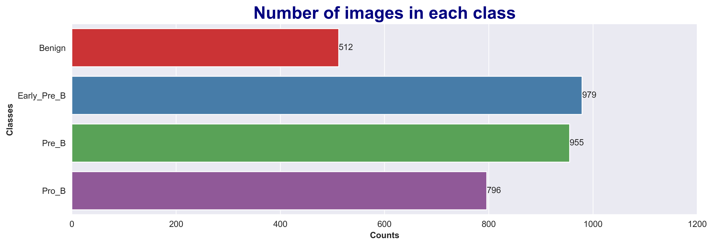
    


## <a id='step24'></a>
## <span style="background-color:orange ;background-size: cover;font-family:tahoma;font-size:70%; font-weight: 900; text-align:left;border-radius:25px 25px; padding:10px; border:solid 2px #09375b"><span style="color:navy">2.4 | Plot Images

<div style="background-color:#fbf8cc; padding: 10px 10px 10px 10px; border-radius: 10px; box-shadow: 2px 2px 4px 0 rgba(0, 0, 0, 0.1);border:0px solid #0A2342; text-align:left">
    <p style="font-size:16px; font-family:tahoma; line-height: 2em; text-indent: 20px;">🔵 Now plot some images in each class


```python
# A loop to iterate below codes for each class
for class_name in classes :
    # To create a plot with 1 row and 6 column
    fig, ax = plt.subplots(1, 6, figsize=(15, 2))
    # Define a variable for each class_name's path by joining base_directory and each class_name
    class_path = os.path.join(Images, class_name)
    # Files is a list of all image names in each folder (class)
    files = os.listdir(class_path)
    # Choose 6 random image from each class to show in plot
    random_images = random.choices(files, k=6)
    # A loop to iterate in each 6 random images
    for i in range(6) :
        # print class_name as suptitle for each class
        plt.suptitle(class_name, fontsize=20, fontweight='bold')
        # variable img is path of image, by joining class_path and image file name
        img = os.path.join(class_path ,random_images[i])
       # load image in img variable using keras.utils.load_img(image_path) 
        img = Image.open(img)
        # Plot image
        ax[i].imshow(img)
        # Turn axis off
        ax[i].axis('off')
    # Make plots to become nearer to each other
    plt.tight_layout()
```


    
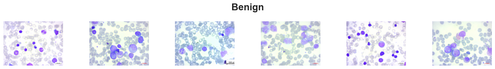
    


    
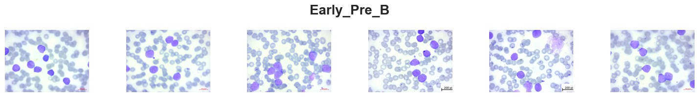
    


    
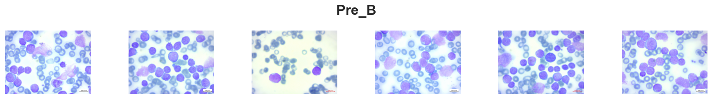
    


    
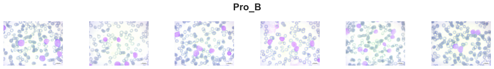
    


## <a id='step25'></a>
## <span style="background-color:orange ;background-size: cover;font-family:tahoma;font-size:70%; font-weight: 900; text-align:left;border-radius:25px 25px; padding:10px; border:solid 2px #09375b"><span style="color:navy">2.5 | Split images to Train-Valid-test folders

<div style="background-color:#fbf8cc; padding: 10px 10px 10px 10px; border-radius: 10px; box-shadow: 2px 2px 4px 0 rgba(0, 0, 0, 0.1);border:0px solid #0A2342; text-align:left">
    <p style="font-size:16px; font-family:tahoma; line-height: 2em; text-indent: 20px;">🔵 In this step, split images to 3 part, <b>Train, Validation and Test</b> by ratio <b>70%, 15%, 15%</b> of whole images.


```python
# create folder for train and validation and test
train_valid = os.path.join(working_dir, 'train_valid')

splitfolders.ratio(
    input=Images, output=train_valid, seed=42, ratio=(0.7, 0.15, 0.15)
)

print(colored(f' All images splited to TRAIN / VALIDATION / TEST folders. ', 'white', 'on_green', attrs=['bold']))
```

    Copying files: 3242 files [00:28, 114.30 files/s]

     All images splited to TRAIN / VALIDATION / TEST folders. 
    

    
    

<div style="background-color:#fbf8cc; padding: 10px 10px 10px 10px; border-radius: 10px; box-shadow: 2px 2px 4px 0 rgba(0, 0, 0, 0.1);border:0px solid #0A2342; text-align:left">
    <p style="font-size:16px; font-family:tahoma; line-height: 2em; text-indent: 20px;">🔵 Count Images in each folder


```python
# list of folders
folders = os.listdir(train_valid)

print(colored('Number of samples in each folder : ', 'green', attrs=['bold']))
for folder in folders :
    # A variable to store count of images in each part
    counts = 0
    folder_path = os.path.join(train_valid, folder)
    for class_name in os.listdir(folder_path) :
        class_path = os.path.join(folder_path, class_name)
        counts += len(os.listdir(class_path))
    print(colored(f'{folder} : {counts}', 'blue',attrs=['bold']))
```

    Number of samples in each folder : 
    test : 490
    train : 2268
    val : 484
    

# <a id='aug'></a> 
# <span style="background-color:#1d3461;background-size: cover;font-family:tahoma;font-size:180%;text-align:center;border-radius:15px 15px; padding:10px; border:solid 2px #09375b"><span style="color:red"><b> 3 | </b></span><span style="color:#ade8f4"><b> DATA AUGMENTATIONS

###### 🏠 [Tabel of Contents](#tbl_content)

<div style="background-color:#fbf8cc; padding: 10px 10px 10px 10px; border-radius: 10px; box-shadow: 2px 2px 4px 0 rgba(0, 0, 0, 0.1);border:0px solid #0A2342; text-align:left">
    <p style="font-size:16px; font-family:tahoma; line-height: 2em; text-indent: 20px;">🔵 Data augmentation is the process of artificially generating new data from existing data, primarily to train new machine learning (ML) models. Data augmentation can address a variety of challenges when training a CNN model, such as limited or imbalanced data, overfitting, and variation and complexity. This technique can increase the size of the dataset and balance the classes by applying different transformations

<div style="background-color:#fbf8cc; padding: 10px 10px 10px 10px; border-radius: 10px; box-shadow: 2px 2px 4px 0 rgba(0, 0, 0, 0.1);border:0px solid #0A2342; text-align:left">
    <p style="font-size:16px; font-family:tahoma; line-height: 2em; text-indent: 20px;">🔵 Here, choose a sample image to plot with each Augmentation function to represent changes.


```python
sample_image = os.path.join(Benign, 'Sap_013 (1).jpg')
```

## <a id='step31'></a>
## <span style="background-color:orange ;background-size: cover;font-family:tahoma;font-size:70%; font-weight: 900; text-align:left;border-radius:25px 25px; padding:10px; border:solid 2px #09375b"><span style="color:navy">3.1 | Blure

<div style="background-color:#fbf8cc; padding: 10px 10px 10px 10px; border-radius: 10px; box-shadow: 2px 2px 4px 0 rgba(0, 0, 0, 0.1);border:0px solid #0A2342; text-align:left">
    <p style="font-size:16px; font-family:tahoma; line-height: 2em; text-indent: 20px;">🔵 Blurring an image is a process that makes the image less sharp and reduces its level of detail. It distorts the detail of an image which makes it less clear. The most common use of image blurriness is to remove noise from the image; the other is to get the most detailed part of the image and smooth out the less detailed ones. Image blur is also called image smoothing.

<div style="background-color:#fbf8cc; padding: 10px 10px 10px 0px; border-radius: 10px; box-shadow: 2px 2px 4px 0 rgba(0, 0, 0, 0.1);border:0px solid #0A2342; text-align:left">
    <p style="font-size:16px; font-family:tahoma; line-height: 2em; text-indent: 20px;">🔵 <b>We use 3 kind of bluring : </b></p>
    <ul style="font-size:16px; font-family:tahoma; line-height: 2em; text-indent: 20px;"> 1. opencv blur (smoothing) </ul>
    <ul style="font-size:16px; font-family:tahoma; line-height: 2em; text-indent: 20px;"> 2. Gausian blur </ul>
    <ul style="font-size:16px; font-family:tahoma; line-height: 2em; text-indent: 20px;"> 3. Meidan blur </ul>


```python
def Blure_Filter(img, filter_type ="blur", kernel=13):
    '''
    ### Filtering ###
    img: image
    filter_type: {blur: blur, gaussian: gaussian, median: median}
    '''
    if filter_type == "blur":
        return cv2.blur(img,(kernel,kernel))
    
    elif filter_type == "gaussian":
        return cv2.GaussianBlur(img, (kernel, kernel), 0)
    
    elif filter_type == "median":
        return cv2.medianBlur(img, kernel)
```

<div style="background-color:#fbf8cc; padding: 10px 10px 10px 0px; border-radius: 10px; box-shadow: 2px 2px 4px 0 rgba(0, 0, 0, 0.1);border:0px solid #0A2342; text-align:left">
    <p style="font-size:16px; font-family:tahoma; line-height: 2em; text-indent: 20px;">🔵 Represent <b>blur function</b> on sample image.


```python
plt.figure(figsize=(10, 2.25), dpi=400)
plt.suptitle('Blured samples', fontweight='bold', fontsize=15)
# Original image
plt.subplot(1, 4, 1)
img = cv2.imread(sample_image)
img = cv2.cvtColor(img, cv2.COLOR_BGR2RGB)
plt.imshow(img)
plt.axis('off')
plt.title('Original', fontweight='bold')
 # Blurs
 # List of filters
filters = ['blur', 'gaussian', 'median']
for filter in filters :
    indx = filters.index(filter)
    plt.subplot(1, 4, indx+2)
    filtered_img = Blure_Filter(img, filter_type=filter, kernel=13)
    plt.imshow(filtered_img)
    plt.axis('off')
    plt.title(filter, fontweight='bold')
```


    
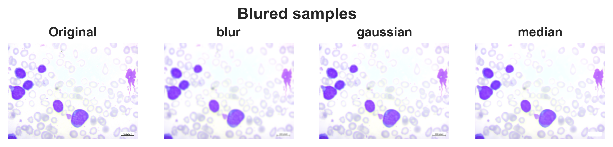
    


## <a id='step32'></a>
## <span style="background-color:orange ;background-size: cover;font-family:tahoma;font-size:70%; font-weight: 900; text-align:left;border-radius:25px 25px; padding:10px; border:solid 2px #09375b"><span style="color:navy">3.2 | Noise

<div style="background-color:#fbf8cc; padding: 10px 10px 10px 10px; border-radius: 10px; box-shadow: 2px 2px 4px 0 rgba(0, 0, 0, 0.1);border:0px solid #0A2342; text-align:left">
    <p style="font-size:16px; font-family:tahoma; line-height: 2em; text-indent: 20px;">🔵 Noise is deliberately altering pixels to be different than what they may should have represented. Old-fashioned films are famous for having speckles black and white pixels present where they should not be. This is noise!  
    Noise is one kind of imperfection that can be particularly frustrating for machines versus human understanding. While humans can easily ignore noise (or fit it within appropriate context), algorithms struggle. This is the root of so-called adversarial attacks where small, human-imperceptible pixel changes can dramatically alter a neural network's ability to make an accurate prediction.

<div style="background-color:#fbf8cc; padding: 10px 10px 10px 0px; border-radius: 10px; box-shadow: 2px 2px 4px 0 rgba(0, 0, 0, 0.1);border:0px solid #0A2342; text-align:left">
    <p style="font-size:16px; font-family:tahoma; line-height: 2em; text-indent: 20px;">🔵 <b>We use 3 kind of Noise adding : </b></p>
    <ul style="font-size:16px; font-family:tahoma; line-height: 2em; text-indent: 20px;"> 1. Gaussian noise </ul>
    <ul style="font-size:16px; font-family:tahoma; line-height: 2em; text-indent: 20px;"> 2. sp noise </ul>


```python
def Add_Noise(img, noise_type="gauss"):
    '''
    ### Adding Noise ###
    img: image
    cj_type: {gauss: gaussian, sp: salt & pepper}
    '''
    if noise_type == "gauss": 
        mean=0
        st=0.5
        gauss = np.random.normal(mean,st,img.shape)
        gauss = gauss.astype('uint8')
        image = cv2.add(img,gauss)
        return image
    
    elif noise_type == "sp": 
        prob = 0.01
        black = np.array([0, 0, 0], dtype='uint8')
        white = np.array([255, 255, 255], dtype='uint8')

        probs = np.random.random(img.shape[:2])
        img[probs < (prob / 2)] = black
        img[probs > 1 - (prob / 2)] = white
        return img
```

<div style="background-color:#fbf8cc; padding: 10px 10px 10px 0px; border-radius: 10px; box-shadow: 2px 2px 4px 0 rgba(0, 0, 0, 0.1);border:0px solid #0A2342; text-align:left">
    <p style="font-size:16px; font-family:tahoma; line-height: 2em; text-indent: 20px;">🔵 Represent <b>Noise adding function</b> on sample image.


```python
plt.figure(figsize=(10, 2.75), dpi=400)
plt.suptitle('Noised samples', fontweight='bold', fontsize=15)
plt.subplot(1, 3, 1)
img = cv2.imread(sample_image)
img = cv2.cvtColor(img, cv2.COLOR_BGR2RGB)
plt.imshow(img)
plt.axis('off')
plt.title('Original', fontweight='bold')

noises = ['gauss', 'sp']
for noise in noises :
    indx = noises.index(noise)
    plt.subplot(1, 3, indx+2)
    noised_img = Add_Noise(img, noise_type=noise)
    plt.imshow(noised_img)
    plt.axis('off')
    plt.title(noise, fontweight='bold')
```


    
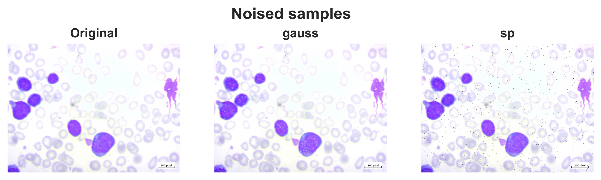
    


## <a id='step33'></a>
## <span style="background-color:orange ;background-size: cover;font-family:tahoma;font-size:70%; font-weight: 900; text-align:left;border-radius:25px 25px; padding:10px; border:solid 2px #09375b"><span style="color:navy">3.3 | Flip

<div style="background-color:#fbf8cc; padding: 10px 10px 10px 10px; border-radius: 10px; box-shadow: 2px 2px 4px 0 rgba(0, 0, 0, 0.1);border:0px solid #0A2342; text-align:left">
    <p style="font-size:16px; font-family:tahoma; line-height: 2em; text-indent: 20px;">🔵 Flipping an image (and its annotations) is a deceivingly simple technique that can improve model performance in substantial ways.

Our models are learning what collection of pixels and the relationship between those collections of pixels denote an object is in-frame. But machine learning models (like convolutional neural networks) have a tendency to be quite brittle: they might memorize a specific ordering of pixels describes an object, but if that same object is mirrored across the image, our models may struggle to recognize it.

Consider the orientation of your face when you are taking a selfie versus using the backwards lens on your camera: one interpretation may be mirrored while the other is not, yet they are still both your face. This mirroring of orientation is what we call flipping an image.

By creating several versions of our images in various orientations, we give our deep learning model more information to learn from without having to go through the time consuming process of collecting and labeling more training data.

<div style="background-color:#fbf8cc; padding: 10px 10px 10px 10px; border-radius: 10px; box-shadow: 2px 2px 4px 0 rgba(0, 0, 0, 0.1);border:0px solid #0A2342; text-align:left">
    <p style="font-size:16px; font-family:tahoma; line-height: 2em; text-indent: 20px;">🔵 <b>We use 3 kind of Fliping : </b></p>
    <ul style="font-size:16px; font-family:tahoma; line-height: 2em; text-indent: 20px;"> 1. X axis </ul>
    <ul style="font-size:16px; font-family:tahoma; line-height: 2em; text-indent: 20px;"> 2. Y axis </ul>
    <ul style="font-size:16px; font-family:tahoma; line-height: 2em; text-indent: 20px;"> 3. X & Y  </ul>


```python
def Flip(img, flip_code) :
    flipped_img = cv2.flip(img, flip_code)
    return flipped_img
```

<div style="background-color:#fbf8cc; padding: 10px 10px 10px 0px; border-radius: 10px; box-shadow: 2px 2px 4px 0 rgba(0, 0, 0, 0.1);border:0px solid #0A2342; text-align:left">
    <p style="font-size:16px; font-family:tahoma; line-height: 2em; text-indent: 20px;">🔵 Represent <b>Flip function</b> on sample image.


```python
plt.figure(figsize=(10, 2.75), dpi=400)
plt.suptitle('Flip a sample', fontweight='bold', fontsize=15)

plt.subplot(1, 4, 1)
img = cv2.imread(sample_image)
img = cv2.cvtColor(img, cv2.COLOR_BGR2RGB)
plt.imshow(img)
plt.axis('off')
plt.title('Original', fontweight='bold')

plt.subplot(1, 4, 2)
fliped = Flip(img, flip_code=0)
plt.imshow(fliped)
plt.axis('off')
plt.title('Horizontal Flip', fontweight='bold')

plt.subplot(1, 4, 3)
fliped = Flip(img, flip_code=1)
plt.imshow(fliped)
plt.axis('off')
plt.title('Vertical Flip', fontweight='bold')

plt.subplot(1, 4, 4)
fliped = Flip(img, flip_code=-1)
plt.imshow(fliped)
plt.axis('off')
plt.title('X&Y Flip', fontweight='bold')
plt.show()
```


    
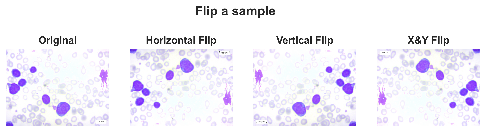
    


## <a id='step34'></a>
## <span style="background-color:orange ;background-size: cover;font-family:tahoma;font-size:70%; font-weight: 900; text-align:left;border-radius:25px 25px; padding:10px; border:solid 2px #09375b"><span style="color:navy">3.4 | Apply Augmantations

<div style="background-color:#fbf8cc; padding: 10px 10px 10px 0px; border-radius: 10px; box-shadow: 2px 2px 4px 0 rgba(0, 0, 0, 0.1);border:0px solid #0A2342; text-align:left">
    <p style="font-size:16px; font-family:tahoma; line-height: 2em; text-indent: 20px;">🔵 OK ! Its time to apply above functions to <b>Train images</b> . Do this by define a function to choose randomly between 3 kind of augs and apply them to images. At last return a <b>dictionary</b> with <b>key</b> of new image name and <b>value</b> of augmented images.


```python
def Apply_Augmentations(img) :
    ''' Apply random choice of augmentation functions on images '''

    returned_augs = dict()

    AUGS = ['Blure', 'Noise', 'Flip']

    # How many of Augs choosen ?
    random_num = random.randint(1, 3)
    random_choice = random.choices(AUGS, k=random_num)
    # To avoid repeatations :
    random_choice = list(set(random_choice))

    for choice in random_choice :
        if choice == 'Blure' :
            filters = ['blur', 'gaussian', 'median']
            kernels = [5, 7, 9, 11]
            random_filter = random.choices(filters, k=1)[0]
            random_kernel = random.choices(kernels, k=1)[0]
            blured_img =  Blure_Filter(img, filter_type=random_filter, kernel=random_kernel)
            new_name = '_blured'
            returned_augs[new_name] = blured_img


        elif choice == 'Noise' :
            noises = ['gauss', 'sp']
            random_noise = random.choices(noises, k=1)[0]
            noised_img = Add_Noise(img, noise_type=random_noise)
            new_name = '_noised'
            returned_augs[new_name] = noised_img


        elif choice == 'Flip' :
            flip_codes = [-1, 0, 1]
            random_code = random.choices(flip_codes, k=1)[0]
            flipped_img = Flip(img, flip_code=random_code)
            new_name = '_fliped'
            returned_augs[new_name] = flipped_img
            
    return returned_augs
```

<div style="background-color:#fbf8cc; padding: 10px 10px 10px 0px; border-radius: 10px; box-shadow: 2px 2px 4px 0 rgba(0, 0, 0, 0.1);border:0px solid #0A2342; text-align:left">
    <p style="font-size:16px; font-family:tahoma; line-height: 2em; text-indent: 20px;">🔵 Count images in train folder beforeand after of augmentation to find out how many images added to train folder.


```python
train_dir = os.path.join(train_valid, 'train')
num_samples_befor_aug = 0

for folder in os.listdir(train_dir) :
    folder_path = os.path.join(train_dir, folder)
    num_samples_befor_aug += len(os.listdir(folder_path))

print(colored(f' Number of samples in TRAIN folder befor Augmentation : {num_samples_befor_aug} ', 'black', 'on_white', attrs=['bold']))
```

     Number of samples in TRAIN folder befor Augmentation : 2268 
    


```python
for folder in os.listdir(train_dir) :
    folder_path = os.path.join(train_dir, folder)
    for img_name in tqdm(os.listdir(folder_path)) :
        img_path = os.path.join(folder_path, img_name)
        img = cv2.imread(img_path)
        returned = Apply_Augmentations(img)

        for exported_name, exported_image in returned.items() :
            # 1_left.jpg ---TO---> 1_lef_blured.jpg
            new_name = img_name.split('.')[0] + exported_name + '.' + img_name.split('.')[-1]
            new_path = os.path.join(folder_path, new_name)
        
            # Save new image
            cv2.imwrite(new_path, exported_image)


print(colored(f' Augmentation Completed. ', 'white', 'on_green', attrs=['bold']))
```


      0%|          | 0/358 [00:00<?, ?it/s]


      0%|          | 0/685 [00:00<?, ?it/s]


      0%|          | 0/668 [00:00<?, ?it/s]


      0%|          | 0/557 [00:00<?, ?it/s]


     Augmentation Completed. 
    


```python
num_samples_after_aug = 0

for folder in os.listdir(train_dir) :
    folder_path = os.path.join(train_dir, folder)
    num_samples_after_aug += len(os.listdir(folder_path))

print(colored(f' Number of samples  in TRAIN folder after Augmentation : {num_samples_after_aug} ', 'black', 'on_white', attrs=['bold']))
```

     Number of samples  in TRAIN folder after Augmentation : 5917 
    


```python
print(colored(f' {num_samples_after_aug-num_samples_befor_aug} images added to train directory. ', 'white', 'on_blue', attrs=['bold']))
```

     3649 images added to train directory. 
    

# <a id='dataset'></a> 
# <span style="background-color:#1d3461;background-size: cover;font-family:tahoma;font-size:180%;text-align:center;border-radius:15px 15px; padding:10px; border:solid 2px #09375b"><span style="color:red"><b> 4 | </b></span><span style="color:#ade8f4"><b> DataSets and DataLoaders

###### 🏠 [Tabel of Contents](#tbl_content)

<div style="background-color:#fbf8cc; padding: 10px 10px 10px 0px; border-radius: 10px; box-shadow: 2px 2px 4px 0 rgba(0, 0, 0, 0.1);border:0px solid #0A2342; text-align:left">
    <p style="font-size:16px; font-family:tahoma; line-height: 2em; text-indent: 20px;">🔵 Now, its time to create a dataset of images by some transforms and after that create DataLoader for each dataset.

## <a id='step41'></a>
## <span style="background-color:orange ;background-size: cover;font-family:tahoma;font-size:70%; font-weight: 900; text-align:left;border-radius:25px 25px; padding:10px; border:solid 2px #09375b"><span style="color:navy">4.1 | Create Datasets and DataLoaders

<div style="background-color:#fbf8cc; padding: 10px 10px 10px 10px; border-radius: 10px; box-shadow: 2px 2px 4px 0 rgba(0, 0, 0, 0.1);border:0px solid #0A2342; text-align:left">
    <p style="font-size:16px; font-family:tahoma; line-height: 2em; text-indent: 20px;">🔵 Torchvision supports common computer vision transformations in the torchvision.transforms and torchvision.transforms.v2 modules. Transforms can be used to transform or augment data for training or inference of different tasks (image classification, detection, segmentation, video classification).


```python
transform = transforms.Compose(
    [
        transforms.Resize(img_size),
        transforms.ToTensor()
    ]
)
```


```python
############################# TRAIN #############################
# Dataset
train_ds = ImageFolder(root=os.path.join(train_valid, 'train'), transform=transform)

# DataLoader
train_loader = DataLoader(train_ds, batch_size=batch_size, shuffle=True)

print(colored(f'TRAIN Folder :\n', 'green', attrs=['bold']))
print(train_ds)

############################# VALIDATION #############################
# Dataset
valid_ds = ImageFolder(root=os.path.join(train_valid, 'val'), transform=transform)

# DataLoader
valid_loader = DataLoader(valid_ds, batch_size=batch_size, shuffle=True)

print(colored(f'VALID Folder :\n', 'green', attrs=['bold']))
print(valid_ds)

############################# TEST #############################
# Dataset
test_ds = ImageFolder(root=os.path.join(train_valid, 'test'), transform=transform)

# DataLoader
test_loader = DataLoader(test_ds, batch_size=batch_size, shuffle=True)

print(colored(f'TEST Folder :\n', 'green', attrs=['bold']))
print(test_ds)
```

    TRAIN Folder :
    
    Dataset ImageFolder
        Number of datapoints: 5917
        Root location: C:\envs\Working\Blood_Cell_Cancer\train_valid\train
        StandardTransform
    Transform: Compose(
                   Resize(size=(128, 128), interpolation=bilinear, max_size=None, antialias=True)
                   ToTensor()
               )
    VALID Folder :
    
    Dataset ImageFolder
        Number of datapoints: 484
        Root location: C:\envs\Working\Blood_Cell_Cancer\train_valid\val
        StandardTransform
    Transform: Compose(
                   Resize(size=(128, 128), interpolation=bilinear, max_size=None, antialias=True)
                   ToTensor()
               )
    TEST Folder :
    
    Dataset ImageFolder
        Number of datapoints: 490
        Root location: C:\envs\Working\Blood_Cell_Cancer\train_valid\test
        StandardTransform
    Transform: Compose(
                   Resize(size=(128, 128), interpolation=bilinear, max_size=None, antialias=True)
                   ToTensor()
               )
    

## <a id='step42'></a>
## <span style="background-color:orange ;background-size: cover;font-family:tahoma;font-size:70%; font-weight: 900; text-align:left;border-radius:25px 25px; padding:10px; border:solid 2px #09375b"><span style="color:navy">4.2 | Data Shapes

<div style="background-color:#fbf8cc; padding: 10px 10px 10px 0px; border-radius: 10px; box-shadow: 2px 2px 4px 0 rgba(0, 0, 0, 0.1);border:0px solid #0A2342; text-align:left">
    <p style="font-size:16px; font-family:tahoma; line-height: 2em; text-indent: 20px;">🔵 Read a batch of data from each loaders(train_loader, valid_loader, test_loader), to represet shape of bach and its data type.


```python
# print shape of dataset for each set
for key, value in {'Train': train_loader, "Validation": valid_loader, 'Test': test_loader}.items():
    for X, y in value:
        print(colored(f'{key}:', 'white','on_green', attrs=['bold']))
        print(f"Shape of images [Batch_size, Channels, Height, Width]: {X.shape}")
        print(f"Shape of y: {y.shape} {y.dtype}\n")
        print('-'*45)
        break
```

    Train:
    Shape of images [Batch_size, Channels, Height, Width]: torch.Size([64, 3, 128, 128])
    Shape of y: torch.Size([64]) torch.int64
    
    ---------------------------------------------
    Validation:
    Shape of images [Batch_size, Channels, Height, Width]: torch.Size([64, 3, 128, 128])
    Shape of y: torch.Size([64]) torch.int64
    
    ---------------------------------------------
    Test:
    Shape of images [Batch_size, Channels, Height, Width]: torch.Size([64, 3, 128, 128])
    Shape of y: torch.Size([64]) torch.int64
    
    ---------------------------------------------
    

# <a id='free'></a> 
# <span style="background-color:#1d3461;background-size: cover;font-family:tahoma;font-size:180%;text-align:center;border-radius:15px 15px; padding:10px; border:solid 2px #09375b"><span style="color:red"><b> 5 | </b></span><span style="color:#ade8f4"><b> FreeUp some space in RAM and GPU

###### 🏠 [Tabel of Contents](#tbl_content)

<div style="background-color:#fbf8cc; padding: 10px 10px 10px 0px; border-radius: 10px; box-shadow: 2px 2px 4px 0 rgba(0, 0, 0, 0.1);border:0px solid #0A2342; text-align:left">
    <p style="font-size:16px; font-family:tahoma; line-height: 2em; text-indent: 20px;">🔵 Because of defining lots of variables and functions, our RAM may filled with unneccessary data and our GPU may be filled too.  In this part by <b>Deleting</b> unneccessary variabels and using <code>gc.collect</code> function for RAM and <code>torch.cuda</code> for GPU cache we can free up some space to better performances.

## <a id='step51'></a>
## <span style="background-color:orange ;background-size: cover;font-family:tahoma;font-size:70%; font-weight: 900; text-align:left;border-radius:25px 25px; padding:10px; border:solid 2px #09375b"><span style="color:navy">5.1 | RAM


```python
del [ax, base_dir, Benign, class_name, class_path, counts, colors_dark, exported_image, exported_name,  Early_Pre_B, fig, files, filter, filtered_img, filters, fliped, folder,  folder_path]
del [folders, i, Images, img, indx, key, noise, noised_img, noises, num_classes, num_samples_after_aug, num_samples_befor_aug, Pre_B, Pro_B, random_images]
del [sample_image, train_dir, value, working_dir, X, y, returned, src]
del [img_name, img_path, img_size, new_name, new_path, ]

gc.collect()
```


    72827


## <a id='step52'></a>
## <span style="background-color:orange ;background-size: cover;font-family:tahoma;font-size:70%; font-weight: 900; text-align:left;border-radius:25px 25px; padding:10px; border:solid 2px #09375b"><span style="color:navy">5.2 | GPU


```python
torch.cuda.empty_cache()
```

# <a id='model'></a> 
# <span style="background-color:#1d3461;background-size: cover;font-family:tahoma;font-size:180%;text-align:center;border-radius:15px 15px; padding:10px; border:solid 2px #09375b"><span style="color:red"><b> 6 | </b></span><span style="color:#ade8f4"><b> Model

###### 🏠 [Tabel of Contents](#tbl_content)

<div style="background-color:#fbf8cc; padding: 10px 10px 10px 10px; border-radius: 10px; box-shadow: 2px 2px 4px 0 rgba(0, 0, 0, 0.1);border:0px solid #0A2342; text-align:left">
    <p style="font-size:16px; font-family:tahoma; line-height: 2em; text-indent: 20px;">🔵 Instead of define a new model form scatch , i prefer to use a <b>Pre-Trained</b> model, <b>GoogleNet</b> with its trained wights <b>GoogLeNet_Weights</b> .   
    Google Net (or Inception V1) was proposed by research at Google (with the collaboration of various universities) in 2014 in the research paper titled “Going Deeper with Convolutions”. This architecture was the winner at the ILSVRC 2014 image classification challenge. It has provided a significant decrease in error rate as compared to previous winners AlexNet (Winner of ILSVRC 2012) and ZF-Net (Winner of ILSVRC 2013) and significantly less error rate than VGG (2014 runner up). This architecture uses techniques such as 1×1 convolutions in the middle of the architecture and global average pooling.


## <a id='step61'></a>
## <span style="background-color:orange ;background-size: cover;font-family:tahoma;font-size:70%; font-weight: 900; text-align:left;border-radius:25px 25px; padding:10px; border:solid 2px #09375b"><span style="color:navy">6.1 | PreTrained Model


```python
model = googlenet(weights=GoogLeNet_Weights)
model
```


    GoogLeNet(
      (conv1): BasicConv2d(
        (conv): Conv2d(3, 64, kernel_size=(7, 7), stride=(2, 2), padding=(3, 3), bias=False)
        (bn): BatchNorm2d(64, eps=0.001, momentum=0.1, affine=True, track_running_stats=True)
      )
      (maxpool1): MaxPool2d(kernel_size=3, stride=2, padding=0, dilation=1, ceil_mode=True)
      (conv2): BasicConv2d(
        (conv): Conv2d(64, 64, kernel_size=(1, 1), stride=(1, 1), bias=False)
        (bn): BatchNorm2d(64, eps=0.001, momentum=0.1, affine=True, track_running_stats=True)
      )
      (conv3): BasicConv2d(
        (conv): Conv2d(64, 192, kernel_size=(3, 3), stride=(1, 1), padding=(1, 1), bias=False)
        (bn): BatchNorm2d(192, eps=0.001, momentum=0.1, affine=True, track_running_stats=True)
      )
      (maxpool2): MaxPool2d(kernel_size=3, stride=2, padding=0, dilation=1, ceil_mode=True)
      (inception3a): Inception(
        (branch1): BasicConv2d(
          (conv): Conv2d(192, 64, kernel_size=(1, 1), stride=(1, 1), bias=False)
          (bn): BatchNorm2d(64, eps=0.001, momentum=0.1, affine=True, track_running_stats=True)
        )
        (branch2): Sequential(
          (0): BasicConv2d(
            (conv): Conv2d(192, 96, kernel_size=(1, 1), stride=(1, 1), bias=False)
            (bn): BatchNorm2d(96, eps=0.001, momentum=0.1, affine=True, track_running_stats=True)
          )
          (1): BasicConv2d(
            (conv): Conv2d(96, 128, kernel_size=(3, 3), stride=(1, 1), padding=(1, 1), bias=False)
            (bn): BatchNorm2d(128, eps=0.001, momentum=0.1, affine=True, track_running_stats=True)
          )
        )
        (branch3): Sequential(
          (0): BasicConv2d(
            (conv): Conv2d(192, 16, kernel_size=(1, 1), stride=(1, 1), bias=False)
            (bn): BatchNorm2d(16, eps=0.001, momentum=0.1, affine=True, track_running_stats=True)
          )
          (1): BasicConv2d(
            (conv): Conv2d(16, 32, kernel_size=(3, 3), stride=(1, 1), padding=(1, 1), bias=False)
            (bn): BatchNorm2d(32, eps=0.001, momentum=0.1, affine=True, track_running_stats=True)
          )
        )
        (branch4): Sequential(
          (0): MaxPool2d(kernel_size=3, stride=1, padding=1, dilation=1, ceil_mode=True)
          (1): BasicConv2d(
            (conv): Conv2d(192, 32, kernel_size=(1, 1), stride=(1, 1), bias=False)
            (bn): BatchNorm2d(32, eps=0.001, momentum=0.1, affine=True, track_running_stats=True)
          )
        )
      )
      (inception3b): Inception(
        (branch1): BasicConv2d(
          (conv): Conv2d(256, 128, kernel_size=(1, 1), stride=(1, 1), bias=False)
          (bn): BatchNorm2d(128, eps=0.001, momentum=0.1, affine=True, track_running_stats=True)
        )
        (branch2): Sequential(
          (0): BasicConv2d(
            (conv): Conv2d(256, 128, kernel_size=(1, 1), stride=(1, 1), bias=False)
            (bn): BatchNorm2d(128, eps=0.001, momentum=0.1, affine=True, track_running_stats=True)
          )
          (1): BasicConv2d(
            (conv): Conv2d(128, 192, kernel_size=(3, 3), stride=(1, 1), padding=(1, 1), bias=False)
            (bn): BatchNorm2d(192, eps=0.001, momentum=0.1, affine=True, track_running_stats=True)
          )
        )
        (branch3): Sequential(
          (0): BasicConv2d(
            (conv): Conv2d(256, 32, kernel_size=(1, 1), stride=(1, 1), bias=False)
            (bn): BatchNorm2d(32, eps=0.001, momentum=0.1, affine=True, track_running_stats=True)
          )
          (1): BasicConv2d(
            (conv): Conv2d(32, 96, kernel_size=(3, 3), stride=(1, 1), padding=(1, 1), bias=False)
            (bn): BatchNorm2d(96, eps=0.001, momentum=0.1, affine=True, track_running_stats=True)
          )
        )
        (branch4): Sequential(
          (0): MaxPool2d(kernel_size=3, stride=1, padding=1, dilation=1, ceil_mode=True)
          (1): BasicConv2d(
            (conv): Conv2d(256, 64, kernel_size=(1, 1), stride=(1, 1), bias=False)
            (bn): BatchNorm2d(64, eps=0.001, momentum=0.1, affine=True, track_running_stats=True)
          )
        )
      )
      (maxpool3): MaxPool2d(kernel_size=3, stride=2, padding=0, dilation=1, ceil_mode=True)
      (inception4a): Inception(
        (branch1): BasicConv2d(
          (conv): Conv2d(480, 192, kernel_size=(1, 1), stride=(1, 1), bias=False)
          (bn): BatchNorm2d(192, eps=0.001, momentum=0.1, affine=True, track_running_stats=True)
        )
        (branch2): Sequential(
          (0): BasicConv2d(
            (conv): Conv2d(480, 96, kernel_size=(1, 1), stride=(1, 1), bias=False)
            (bn): BatchNorm2d(96, eps=0.001, momentum=0.1, affine=True, track_running_stats=True)
          )
          (1): BasicConv2d(
            (conv): Conv2d(96, 208, kernel_size=(3, 3), stride=(1, 1), padding=(1, 1), bias=False)
            (bn): BatchNorm2d(208, eps=0.001, momentum=0.1, affine=True, track_running_stats=True)
          )
        )
        (branch3): Sequential(
          (0): BasicConv2d(
            (conv): Conv2d(480, 16, kernel_size=(1, 1), stride=(1, 1), bias=False)
            (bn): BatchNorm2d(16, eps=0.001, momentum=0.1, affine=True, track_running_stats=True)
          )
          (1): BasicConv2d(
            (conv): Conv2d(16, 48, kernel_size=(3, 3), stride=(1, 1), padding=(1, 1), bias=False)
            (bn): BatchNorm2d(48, eps=0.001, momentum=0.1, affine=True, track_running_stats=True)
          )
        )
        (branch4): Sequential(
          (0): MaxPool2d(kernel_size=3, stride=1, padding=1, dilation=1, ceil_mode=True)
          (1): BasicConv2d(
            (conv): Conv2d(480, 64, kernel_size=(1, 1), stride=(1, 1), bias=False)
            (bn): BatchNorm2d(64, eps=0.001, momentum=0.1, affine=True, track_running_stats=True)
          )
        )
      )
      (inception4b): Inception(
        (branch1): BasicConv2d(
          (conv): Conv2d(512, 160, kernel_size=(1, 1), stride=(1, 1), bias=False)
          (bn): BatchNorm2d(160, eps=0.001, momentum=0.1, affine=True, track_running_stats=True)
        )
        (branch2): Sequential(
          (0): BasicConv2d(
            (conv): Conv2d(512, 112, kernel_size=(1, 1), stride=(1, 1), bias=False)
            (bn): BatchNorm2d(112, eps=0.001, momentum=0.1, affine=True, track_running_stats=True)
          )
          (1): BasicConv2d(
            (conv): Conv2d(112, 224, kernel_size=(3, 3), stride=(1, 1), padding=(1, 1), bias=False)
            (bn): BatchNorm2d(224, eps=0.001, momentum=0.1, affine=True, track_running_stats=True)
          )
        )
        (branch3): Sequential(
          (0): BasicConv2d(
            (conv): Conv2d(512, 24, kernel_size=(1, 1), stride=(1, 1), bias=False)
            (bn): BatchNorm2d(24, eps=0.001, momentum=0.1, affine=True, track_running_stats=True)
          )
          (1): BasicConv2d(
            (conv): Conv2d(24, 64, kernel_size=(3, 3), stride=(1, 1), padding=(1, 1), bias=False)
            (bn): BatchNorm2d(64, eps=0.001, momentum=0.1, affine=True, track_running_stats=True)
          )
        )
        (branch4): Sequential(
          (0): MaxPool2d(kernel_size=3, stride=1, padding=1, dilation=1, ceil_mode=True)
          (1): BasicConv2d(
            (conv): Conv2d(512, 64, kernel_size=(1, 1), stride=(1, 1), bias=False)
            (bn): BatchNorm2d(64, eps=0.001, momentum=0.1, affine=True, track_running_stats=True)
          )
        )
      )
      (inception4c): Inception(
        (branch1): BasicConv2d(
          (conv): Conv2d(512, 128, kernel_size=(1, 1), stride=(1, 1), bias=False)
          (bn): BatchNorm2d(128, eps=0.001, momentum=0.1, affine=True, track_running_stats=True)
        )
        (branch2): Sequential(
          (0): BasicConv2d(
            (conv): Conv2d(512, 128, kernel_size=(1, 1), stride=(1, 1), bias=False)
            (bn): BatchNorm2d(128, eps=0.001, momentum=0.1, affine=True, track_running_stats=True)
          )
          (1): BasicConv2d(
            (conv): Conv2d(128, 256, kernel_size=(3, 3), stride=(1, 1), padding=(1, 1), bias=False)
            (bn): BatchNorm2d(256, eps=0.001, momentum=0.1, affine=True, track_running_stats=True)
          )
        )
        (branch3): Sequential(
          (0): BasicConv2d(
            (conv): Conv2d(512, 24, kernel_size=(1, 1), stride=(1, 1), bias=False)
            (bn): BatchNorm2d(24, eps=0.001, momentum=0.1, affine=True, track_running_stats=True)
          )
          (1): BasicConv2d(
            (conv): Conv2d(24, 64, kernel_size=(3, 3), stride=(1, 1), padding=(1, 1), bias=False)
            (bn): BatchNorm2d(64, eps=0.001, momentum=0.1, affine=True, track_running_stats=True)
          )
        )
        (branch4): Sequential(
          (0): MaxPool2d(kernel_size=3, stride=1, padding=1, dilation=1, ceil_mode=True)
          (1): BasicConv2d(
            (conv): Conv2d(512, 64, kernel_size=(1, 1), stride=(1, 1), bias=False)
            (bn): BatchNorm2d(64, eps=0.001, momentum=0.1, affine=True, track_running_stats=True)
          )
        )
      )
      (inception4d): Inception(
        (branch1): BasicConv2d(
          (conv): Conv2d(512, 112, kernel_size=(1, 1), stride=(1, 1), bias=False)
          (bn): BatchNorm2d(112, eps=0.001, momentum=0.1, affine=True, track_running_stats=True)
        )
        (branch2): Sequential(
          (0): BasicConv2d(
            (conv): Conv2d(512, 144, kernel_size=(1, 1), stride=(1, 1), bias=False)
            (bn): BatchNorm2d(144, eps=0.001, momentum=0.1, affine=True, track_running_stats=True)
          )
          (1): BasicConv2d(
            (conv): Conv2d(144, 288, kernel_size=(3, 3), stride=(1, 1), padding=(1, 1), bias=False)
            (bn): BatchNorm2d(288, eps=0.001, momentum=0.1, affine=True, track_running_stats=True)
          )
        )
        (branch3): Sequential(
          (0): BasicConv2d(
            (conv): Conv2d(512, 32, kernel_size=(1, 1), stride=(1, 1), bias=False)
            (bn): BatchNorm2d(32, eps=0.001, momentum=0.1, affine=True, track_running_stats=True)
          )
          (1): BasicConv2d(
            (conv): Conv2d(32, 64, kernel_size=(3, 3), stride=(1, 1), padding=(1, 1), bias=False)
            (bn): BatchNorm2d(64, eps=0.001, momentum=0.1, affine=True, track_running_stats=True)
          )
        )
        (branch4): Sequential(
          (0): MaxPool2d(kernel_size=3, stride=1, padding=1, dilation=1, ceil_mode=True)
          (1): BasicConv2d(
            (conv): Conv2d(512, 64, kernel_size=(1, 1), stride=(1, 1), bias=False)
            (bn): BatchNorm2d(64, eps=0.001, momentum=0.1, affine=True, track_running_stats=True)
          )
        )
      )
      (inception4e): Inception(
        (branch1): BasicConv2d(
          (conv): Conv2d(528, 256, kernel_size=(1, 1), stride=(1, 1), bias=False)
          (bn): BatchNorm2d(256, eps=0.001, momentum=0.1, affine=True, track_running_stats=True)
        )
        (branch2): Sequential(
          (0): BasicConv2d(
            (conv): Conv2d(528, 160, kernel_size=(1, 1), stride=(1, 1), bias=False)
            (bn): BatchNorm2d(160, eps=0.001, momentum=0.1, affine=True, track_running_stats=True)
          )
          (1): BasicConv2d(
            (conv): Conv2d(160, 320, kernel_size=(3, 3), stride=(1, 1), padding=(1, 1), bias=False)
            (bn): BatchNorm2d(320, eps=0.001, momentum=0.1, affine=True, track_running_stats=True)
          )
        )
        (branch3): Sequential(
          (0): BasicConv2d(
            (conv): Conv2d(528, 32, kernel_size=(1, 1), stride=(1, 1), bias=False)
            (bn): BatchNorm2d(32, eps=0.001, momentum=0.1, affine=True, track_running_stats=True)
          )
          (1): BasicConv2d(
            (conv): Conv2d(32, 128, kernel_size=(3, 3), stride=(1, 1), padding=(1, 1), bias=False)
            (bn): BatchNorm2d(128, eps=0.001, momentum=0.1, affine=True, track_running_stats=True)
          )
        )
        (branch4): Sequential(
          (0): MaxPool2d(kernel_size=3, stride=1, padding=1, dilation=1, ceil_mode=True)
          (1): BasicConv2d(
            (conv): Conv2d(528, 128, kernel_size=(1, 1), stride=(1, 1), bias=False)
            (bn): BatchNorm2d(128, eps=0.001, momentum=0.1, affine=True, track_running_stats=True)
          )
        )
      )
      (maxpool4): MaxPool2d(kernel_size=2, stride=2, padding=0, dilation=1, ceil_mode=True)
      (inception5a): Inception(
        (branch1): BasicConv2d(
          (conv): Conv2d(832, 256, kernel_size=(1, 1), stride=(1, 1), bias=False)
          (bn): BatchNorm2d(256, eps=0.001, momentum=0.1, affine=True, track_running_stats=True)
        )
        (branch2): Sequential(
          (0): BasicConv2d(
            (conv): Conv2d(832, 160, kernel_size=(1, 1), stride=(1, 1), bias=False)
            (bn): BatchNorm2d(160, eps=0.001, momentum=0.1, affine=True, track_running_stats=True)
          )
          (1): BasicConv2d(
            (conv): Conv2d(160, 320, kernel_size=(3, 3), stride=(1, 1), padding=(1, 1), bias=False)
            (bn): BatchNorm2d(320, eps=0.001, momentum=0.1, affine=True, track_running_stats=True)
          )
        )
        (branch3): Sequential(
          (0): BasicConv2d(
            (conv): Conv2d(832, 32, kernel_size=(1, 1), stride=(1, 1), bias=False)
            (bn): BatchNorm2d(32, eps=0.001, momentum=0.1, affine=True, track_running_stats=True)
          )
          (1): BasicConv2d(
            (conv): Conv2d(32, 128, kernel_size=(3, 3), stride=(1, 1), padding=(1, 1), bias=False)
            (bn): BatchNorm2d(128, eps=0.001, momentum=0.1, affine=True, track_running_stats=True)
          )
        )
        (branch4): Sequential(
          (0): MaxPool2d(kernel_size=3, stride=1, padding=1, dilation=1, ceil_mode=True)
          (1): BasicConv2d(
            (conv): Conv2d(832, 128, kernel_size=(1, 1), stride=(1, 1), bias=False)
            (bn): BatchNorm2d(128, eps=0.001, momentum=0.1, affine=True, track_running_stats=True)
          )
        )
      )
      (inception5b): Inception(
        (branch1): BasicConv2d(
          (conv): Conv2d(832, 384, kernel_size=(1, 1), stride=(1, 1), bias=False)
          (bn): BatchNorm2d(384, eps=0.001, momentum=0.1, affine=True, track_running_stats=True)
        )
        (branch2): Sequential(
          (0): BasicConv2d(
            (conv): Conv2d(832, 192, kernel_size=(1, 1), stride=(1, 1), bias=False)
            (bn): BatchNorm2d(192, eps=0.001, momentum=0.1, affine=True, track_running_stats=True)
          )
          (1): BasicConv2d(
            (conv): Conv2d(192, 384, kernel_size=(3, 3), stride=(1, 1), padding=(1, 1), bias=False)
            (bn): BatchNorm2d(384, eps=0.001, momentum=0.1, affine=True, track_running_stats=True)
          )
        )
        (branch3): Sequential(
          (0): BasicConv2d(
            (conv): Conv2d(832, 48, kernel_size=(1, 1), stride=(1, 1), bias=False)
            (bn): BatchNorm2d(48, eps=0.001, momentum=0.1, affine=True, track_running_stats=True)
          )
          (1): BasicConv2d(
            (conv): Conv2d(48, 128, kernel_size=(3, 3), stride=(1, 1), padding=(1, 1), bias=False)
            (bn): BatchNorm2d(128, eps=0.001, momentum=0.1, affine=True, track_running_stats=True)
          )
        )
        (branch4): Sequential(
          (0): MaxPool2d(kernel_size=3, stride=1, padding=1, dilation=1, ceil_mode=True)
          (1): BasicConv2d(
            (conv): Conv2d(832, 128, kernel_size=(1, 1), stride=(1, 1), bias=False)
            (bn): BatchNorm2d(128, eps=0.001, momentum=0.1, affine=True, track_running_stats=True)
          )
        )
      )
      (aux1): None
      (aux2): None
      (avgpool): AdaptiveAvgPool2d(output_size=(1, 1))
      (dropout): Dropout(p=0.2, inplace=False)
      (fc): Linear(in_features=1024, out_features=1000, bias=True)
    )


## <a id='step62'></a>
## <span style="background-color:orange ;background-size: cover;font-family:tahoma;font-size:70%; font-weight: 900; text-align:left;border-radius:25px 25px; padding:10px; border:solid 2px #09375b"><span style="color:navy">6.2 | Change Last Layer (fc)

<div style="background-color:#fbf8cc; padding: 10px 10px 10px 0px; border-radius: 10px; box-shadow: 2px 2px 4px 0 rgba(0, 0, 0, 0.1);border:0px solid #0A2342; text-align:left">
    <p style="font-size:16px; font-family:tahoma; line-height: 2em; text-indent: 20px;">🔵 Out-feature of GoogleNet has 1000 Neuron, but in this case, our model should have 4 neuron, Length of classes. So change <b>fc</b> part of GoogleNet and replace it with a Sequential of fully connected network.


```python
model.fc = nn.Sequential(
    nn.Linear(in_features=1024, out_features=512),
    nn.ReLU(),
    nn.Dropout(0.2),
     nn.Linear(in_features=512, out_features=128),
    nn.ReLU(),
    nn.Dropout(0.2),
    nn.Linear(in_features=128, out_features=64),
    nn.ReLU(),
    nn.Dropout(0.2),
    nn.Linear(in_features=64, out_features=4)
)
```

<div style="background-color:#fbf8cc; padding: 10px 10px 10px 0px; border-radius: 10px; box-shadow: 2px 2px 4px 0 rgba(0, 0, 0, 0.1);border:0px solid #0A2342; text-align:left">
    <p style="font-size:16px; font-family:tahoma; line-height: 2em; text-indent: 20px;">🔵 Its time to first use of GPU ! Move the model to GPU to accelerate process.


```python
model.to(device)
```


    GoogLeNet(
      (conv1): BasicConv2d(
        (conv): Conv2d(3, 64, kernel_size=(7, 7), stride=(2, 2), padding=(3, 3), bias=False)
        (bn): BatchNorm2d(64, eps=0.001, momentum=0.1, affine=True, track_running_stats=True)
      )
      (maxpool1): MaxPool2d(kernel_size=3, stride=2, padding=0, dilation=1, ceil_mode=True)
      (conv2): BasicConv2d(
        (conv): Conv2d(64, 64, kernel_size=(1, 1), stride=(1, 1), bias=False)
        (bn): BatchNorm2d(64, eps=0.001, momentum=0.1, affine=True, track_running_stats=True)
      )
      (conv3): BasicConv2d(
        (conv): Conv2d(64, 192, kernel_size=(3, 3), stride=(1, 1), padding=(1, 1), bias=False)
        (bn): BatchNorm2d(192, eps=0.001, momentum=0.1, affine=True, track_running_stats=True)
      )
      (maxpool2): MaxPool2d(kernel_size=3, stride=2, padding=0, dilation=1, ceil_mode=True)
      (inception3a): Inception(
        (branch1): BasicConv2d(
          (conv): Conv2d(192, 64, kernel_size=(1, 1), stride=(1, 1), bias=False)
          (bn): BatchNorm2d(64, eps=0.001, momentum=0.1, affine=True, track_running_stats=True)
        )
        (branch2): Sequential(
          (0): BasicConv2d(
            (conv): Conv2d(192, 96, kernel_size=(1, 1), stride=(1, 1), bias=False)
            (bn): BatchNorm2d(96, eps=0.001, momentum=0.1, affine=True, track_running_stats=True)
          )
          (1): BasicConv2d(
            (conv): Conv2d(96, 128, kernel_size=(3, 3), stride=(1, 1), padding=(1, 1), bias=False)
            (bn): BatchNorm2d(128, eps=0.001, momentum=0.1, affine=True, track_running_stats=True)
          )
        )
        (branch3): Sequential(
          (0): BasicConv2d(
            (conv): Conv2d(192, 16, kernel_size=(1, 1), stride=(1, 1), bias=False)
            (bn): BatchNorm2d(16, eps=0.001, momentum=0.1, affine=True, track_running_stats=True)
          )
          (1): BasicConv2d(
            (conv): Conv2d(16, 32, kernel_size=(3, 3), stride=(1, 1), padding=(1, 1), bias=False)
            (bn): BatchNorm2d(32, eps=0.001, momentum=0.1, affine=True, track_running_stats=True)
          )
        )
        (branch4): Sequential(
          (0): MaxPool2d(kernel_size=3, stride=1, padding=1, dilation=1, ceil_mode=True)
          (1): BasicConv2d(
            (conv): Conv2d(192, 32, kernel_size=(1, 1), stride=(1, 1), bias=False)
            (bn): BatchNorm2d(32, eps=0.001, momentum=0.1, affine=True, track_running_stats=True)
          )
        )
      )
      (inception3b): Inception(
        (branch1): BasicConv2d(
          (conv): Conv2d(256, 128, kernel_size=(1, 1), stride=(1, 1), bias=False)
          (bn): BatchNorm2d(128, eps=0.001, momentum=0.1, affine=True, track_running_stats=True)
        )
        (branch2): Sequential(
          (0): BasicConv2d(
            (conv): Conv2d(256, 128, kernel_size=(1, 1), stride=(1, 1), bias=False)
            (bn): BatchNorm2d(128, eps=0.001, momentum=0.1, affine=True, track_running_stats=True)
          )
          (1): BasicConv2d(
            (conv): Conv2d(128, 192, kernel_size=(3, 3), stride=(1, 1), padding=(1, 1), bias=False)
            (bn): BatchNorm2d(192, eps=0.001, momentum=0.1, affine=True, track_running_stats=True)
          )
        )
        (branch3): Sequential(
          (0): BasicConv2d(
            (conv): Conv2d(256, 32, kernel_size=(1, 1), stride=(1, 1), bias=False)
            (bn): BatchNorm2d(32, eps=0.001, momentum=0.1, affine=True, track_running_stats=True)
          )
          (1): BasicConv2d(
            (conv): Conv2d(32, 96, kernel_size=(3, 3), stride=(1, 1), padding=(1, 1), bias=False)
            (bn): BatchNorm2d(96, eps=0.001, momentum=0.1, affine=True, track_running_stats=True)
          )
        )
        (branch4): Sequential(
          (0): MaxPool2d(kernel_size=3, stride=1, padding=1, dilation=1, ceil_mode=True)
          (1): BasicConv2d(
            (conv): Conv2d(256, 64, kernel_size=(1, 1), stride=(1, 1), bias=False)
            (bn): BatchNorm2d(64, eps=0.001, momentum=0.1, affine=True, track_running_stats=True)
          )
        )
      )
      (maxpool3): MaxPool2d(kernel_size=3, stride=2, padding=0, dilation=1, ceil_mode=True)
      (inception4a): Inception(
        (branch1): BasicConv2d(
          (conv): Conv2d(480, 192, kernel_size=(1, 1), stride=(1, 1), bias=False)
          (bn): BatchNorm2d(192, eps=0.001, momentum=0.1, affine=True, track_running_stats=True)
        )
        (branch2): Sequential(
          (0): BasicConv2d(
            (conv): Conv2d(480, 96, kernel_size=(1, 1), stride=(1, 1), bias=False)
            (bn): BatchNorm2d(96, eps=0.001, momentum=0.1, affine=True, track_running_stats=True)
          )
          (1): BasicConv2d(
            (conv): Conv2d(96, 208, kernel_size=(3, 3), stride=(1, 1), padding=(1, 1), bias=False)
            (bn): BatchNorm2d(208, eps=0.001, momentum=0.1, affine=True, track_running_stats=True)
          )
        )
        (branch3): Sequential(
          (0): BasicConv2d(
            (conv): Conv2d(480, 16, kernel_size=(1, 1), stride=(1, 1), bias=False)
            (bn): BatchNorm2d(16, eps=0.001, momentum=0.1, affine=True, track_running_stats=True)
          )
          (1): BasicConv2d(
            (conv): Conv2d(16, 48, kernel_size=(3, 3), stride=(1, 1), padding=(1, 1), bias=False)
            (bn): BatchNorm2d(48, eps=0.001, momentum=0.1, affine=True, track_running_stats=True)
          )
        )
        (branch4): Sequential(
          (0): MaxPool2d(kernel_size=3, stride=1, padding=1, dilation=1, ceil_mode=True)
          (1): BasicConv2d(
            (conv): Conv2d(480, 64, kernel_size=(1, 1), stride=(1, 1), bias=False)
            (bn): BatchNorm2d(64, eps=0.001, momentum=0.1, affine=True, track_running_stats=True)
          )
        )
      )
      (inception4b): Inception(
        (branch1): BasicConv2d(
          (conv): Conv2d(512, 160, kernel_size=(1, 1), stride=(1, 1), bias=False)
          (bn): BatchNorm2d(160, eps=0.001, momentum=0.1, affine=True, track_running_stats=True)
        )
        (branch2): Sequential(
          (0): BasicConv2d(
            (conv): Conv2d(512, 112, kernel_size=(1, 1), stride=(1, 1), bias=False)
            (bn): BatchNorm2d(112, eps=0.001, momentum=0.1, affine=True, track_running_stats=True)
          )
          (1): BasicConv2d(
            (conv): Conv2d(112, 224, kernel_size=(3, 3), stride=(1, 1), padding=(1, 1), bias=False)
            (bn): BatchNorm2d(224, eps=0.001, momentum=0.1, affine=True, track_running_stats=True)
          )
        )
        (branch3): Sequential(
          (0): BasicConv2d(
            (conv): Conv2d(512, 24, kernel_size=(1, 1), stride=(1, 1), bias=False)
            (bn): BatchNorm2d(24, eps=0.001, momentum=0.1, affine=True, track_running_stats=True)
          )
          (1): BasicConv2d(
            (conv): Conv2d(24, 64, kernel_size=(3, 3), stride=(1, 1), padding=(1, 1), bias=False)
            (bn): BatchNorm2d(64, eps=0.001, momentum=0.1, affine=True, track_running_stats=True)
          )
        )
        (branch4): Sequential(
          (0): MaxPool2d(kernel_size=3, stride=1, padding=1, dilation=1, ceil_mode=True)
          (1): BasicConv2d(
            (conv): Conv2d(512, 64, kernel_size=(1, 1), stride=(1, 1), bias=False)
            (bn): BatchNorm2d(64, eps=0.001, momentum=0.1, affine=True, track_running_stats=True)
          )
        )
      )
      (inception4c): Inception(
        (branch1): BasicConv2d(
          (conv): Conv2d(512, 128, kernel_size=(1, 1), stride=(1, 1), bias=False)
          (bn): BatchNorm2d(128, eps=0.001, momentum=0.1, affine=True, track_running_stats=True)
        )
        (branch2): Sequential(
          (0): BasicConv2d(
            (conv): Conv2d(512, 128, kernel_size=(1, 1), stride=(1, 1), bias=False)
            (bn): BatchNorm2d(128, eps=0.001, momentum=0.1, affine=True, track_running_stats=True)
          )
          (1): BasicConv2d(
            (conv): Conv2d(128, 256, kernel_size=(3, 3), stride=(1, 1), padding=(1, 1), bias=False)
            (bn): BatchNorm2d(256, eps=0.001, momentum=0.1, affine=True, track_running_stats=True)
          )
        )
        (branch3): Sequential(
          (0): BasicConv2d(
            (conv): Conv2d(512, 24, kernel_size=(1, 1), stride=(1, 1), bias=False)
            (bn): BatchNorm2d(24, eps=0.001, momentum=0.1, affine=True, track_running_stats=True)
          )
          (1): BasicConv2d(
            (conv): Conv2d(24, 64, kernel_size=(3, 3), stride=(1, 1), padding=(1, 1), bias=False)
            (bn): BatchNorm2d(64, eps=0.001, momentum=0.1, affine=True, track_running_stats=True)
          )
        )
        (branch4): Sequential(
          (0): MaxPool2d(kernel_size=3, stride=1, padding=1, dilation=1, ceil_mode=True)
          (1): BasicConv2d(
            (conv): Conv2d(512, 64, kernel_size=(1, 1), stride=(1, 1), bias=False)
            (bn): BatchNorm2d(64, eps=0.001, momentum=0.1, affine=True, track_running_stats=True)
          )
        )
      )
      (inception4d): Inception(
        (branch1): BasicConv2d(
          (conv): Conv2d(512, 112, kernel_size=(1, 1), stride=(1, 1), bias=False)
          (bn): BatchNorm2d(112, eps=0.001, momentum=0.1, affine=True, track_running_stats=True)
        )
        (branch2): Sequential(
          (0): BasicConv2d(
            (conv): Conv2d(512, 144, kernel_size=(1, 1), stride=(1, 1), bias=False)
            (bn): BatchNorm2d(144, eps=0.001, momentum=0.1, affine=True, track_running_stats=True)
          )
          (1): BasicConv2d(
            (conv): Conv2d(144, 288, kernel_size=(3, 3), stride=(1, 1), padding=(1, 1), bias=False)
            (bn): BatchNorm2d(288, eps=0.001, momentum=0.1, affine=True, track_running_stats=True)
          )
        )
        (branch3): Sequential(
          (0): BasicConv2d(
            (conv): Conv2d(512, 32, kernel_size=(1, 1), stride=(1, 1), bias=False)
            (bn): BatchNorm2d(32, eps=0.001, momentum=0.1, affine=True, track_running_stats=True)
          )
          (1): BasicConv2d(
            (conv): Conv2d(32, 64, kernel_size=(3, 3), stride=(1, 1), padding=(1, 1), bias=False)
            (bn): BatchNorm2d(64, eps=0.001, momentum=0.1, affine=True, track_running_stats=True)
          )
        )
        (branch4): Sequential(
          (0): MaxPool2d(kernel_size=3, stride=1, padding=1, dilation=1, ceil_mode=True)
          (1): BasicConv2d(
            (conv): Conv2d(512, 64, kernel_size=(1, 1), stride=(1, 1), bias=False)
            (bn): BatchNorm2d(64, eps=0.001, momentum=0.1, affine=True, track_running_stats=True)
          )
        )
      )
      (inception4e): Inception(
        (branch1): BasicConv2d(
          (conv): Conv2d(528, 256, kernel_size=(1, 1), stride=(1, 1), bias=False)
          (bn): BatchNorm2d(256, eps=0.001, momentum=0.1, affine=True, track_running_stats=True)
        )
        (branch2): Sequential(
          (0): BasicConv2d(
            (conv): Conv2d(528, 160, kernel_size=(1, 1), stride=(1, 1), bias=False)
            (bn): BatchNorm2d(160, eps=0.001, momentum=0.1, affine=True, track_running_stats=True)
          )
          (1): BasicConv2d(
            (conv): Conv2d(160, 320, kernel_size=(3, 3), stride=(1, 1), padding=(1, 1), bias=False)
            (bn): BatchNorm2d(320, eps=0.001, momentum=0.1, affine=True, track_running_stats=True)
          )
        )
        (branch3): Sequential(
          (0): BasicConv2d(
            (conv): Conv2d(528, 32, kernel_size=(1, 1), stride=(1, 1), bias=False)
            (bn): BatchNorm2d(32, eps=0.001, momentum=0.1, affine=True, track_running_stats=True)
          )
          (1): BasicConv2d(
            (conv): Conv2d(32, 128, kernel_size=(3, 3), stride=(1, 1), padding=(1, 1), bias=False)
            (bn): BatchNorm2d(128, eps=0.001, momentum=0.1, affine=True, track_running_stats=True)
          )
        )
        (branch4): Sequential(
          (0): MaxPool2d(kernel_size=3, stride=1, padding=1, dilation=1, ceil_mode=True)
          (1): BasicConv2d(
            (conv): Conv2d(528, 128, kernel_size=(1, 1), stride=(1, 1), bias=False)
            (bn): BatchNorm2d(128, eps=0.001, momentum=0.1, affine=True, track_running_stats=True)
          )
        )
      )
      (maxpool4): MaxPool2d(kernel_size=2, stride=2, padding=0, dilation=1, ceil_mode=True)
      (inception5a): Inception(
        (branch1): BasicConv2d(
          (conv): Conv2d(832, 256, kernel_size=(1, 1), stride=(1, 1), bias=False)
          (bn): BatchNorm2d(256, eps=0.001, momentum=0.1, affine=True, track_running_stats=True)
        )
        (branch2): Sequential(
          (0): BasicConv2d(
            (conv): Conv2d(832, 160, kernel_size=(1, 1), stride=(1, 1), bias=False)
            (bn): BatchNorm2d(160, eps=0.001, momentum=0.1, affine=True, track_running_stats=True)
          )
          (1): BasicConv2d(
            (conv): Conv2d(160, 320, kernel_size=(3, 3), stride=(1, 1), padding=(1, 1), bias=False)
            (bn): BatchNorm2d(320, eps=0.001, momentum=0.1, affine=True, track_running_stats=True)
          )
        )
        (branch3): Sequential(
          (0): BasicConv2d(
            (conv): Conv2d(832, 32, kernel_size=(1, 1), stride=(1, 1), bias=False)
            (bn): BatchNorm2d(32, eps=0.001, momentum=0.1, affine=True, track_running_stats=True)
          )
          (1): BasicConv2d(
            (conv): Conv2d(32, 128, kernel_size=(3, 3), stride=(1, 1), padding=(1, 1), bias=False)
            (bn): BatchNorm2d(128, eps=0.001, momentum=0.1, affine=True, track_running_stats=True)
          )
        )
        (branch4): Sequential(
          (0): MaxPool2d(kernel_size=3, stride=1, padding=1, dilation=1, ceil_mode=True)
          (1): BasicConv2d(
            (conv): Conv2d(832, 128, kernel_size=(1, 1), stride=(1, 1), bias=False)
            (bn): BatchNorm2d(128, eps=0.001, momentum=0.1, affine=True, track_running_stats=True)
          )
        )
      )
      (inception5b): Inception(
        (branch1): BasicConv2d(
          (conv): Conv2d(832, 384, kernel_size=(1, 1), stride=(1, 1), bias=False)
          (bn): BatchNorm2d(384, eps=0.001, momentum=0.1, affine=True, track_running_stats=True)
        )
        (branch2): Sequential(
          (0): BasicConv2d(
            (conv): Conv2d(832, 192, kernel_size=(1, 1), stride=(1, 1), bias=False)
            (bn): BatchNorm2d(192, eps=0.001, momentum=0.1, affine=True, track_running_stats=True)
          )
          (1): BasicConv2d(
            (conv): Conv2d(192, 384, kernel_size=(3, 3), stride=(1, 1), padding=(1, 1), bias=False)
            (bn): BatchNorm2d(384, eps=0.001, momentum=0.1, affine=True, track_running_stats=True)
          )
        )
        (branch3): Sequential(
          (0): BasicConv2d(
            (conv): Conv2d(832, 48, kernel_size=(1, 1), stride=(1, 1), bias=False)
            (bn): BatchNorm2d(48, eps=0.001, momentum=0.1, affine=True, track_running_stats=True)
          )
          (1): BasicConv2d(
            (conv): Conv2d(48, 128, kernel_size=(3, 3), stride=(1, 1), padding=(1, 1), bias=False)
            (bn): BatchNorm2d(128, eps=0.001, momentum=0.1, affine=True, track_running_stats=True)
          )
        )
        (branch4): Sequential(
          (0): MaxPool2d(kernel_size=3, stride=1, padding=1, dilation=1, ceil_mode=True)
          (1): BasicConv2d(
            (conv): Conv2d(832, 128, kernel_size=(1, 1), stride=(1, 1), bias=False)
            (bn): BatchNorm2d(128, eps=0.001, momentum=0.1, affine=True, track_running_stats=True)
          )
        )
      )
      (aux1): None
      (aux2): None
      (avgpool): AdaptiveAvgPool2d(output_size=(1, 1))
      (dropout): Dropout(p=0.2, inplace=False)
      (fc): Sequential(
        (0): Linear(in_features=1024, out_features=512, bias=True)
        (1): ReLU()
        (2): Dropout(p=0.2, inplace=False)
        (3): Linear(in_features=512, out_features=128, bias=True)
        (4): ReLU()
        (5): Dropout(p=0.2, inplace=False)
        (6): Linear(in_features=128, out_features=64, bias=True)
        (7): ReLU()
        (8): Dropout(p=0.2, inplace=False)
        (9): Linear(in_features=64, out_features=4, bias=True)
      )
    )


## <a id='step63'></a>
## <span style="background-color:orange ;background-size: cover;font-family:tahoma;font-size:70%; font-weight: 900; text-align:left;border-radius:25px 25px; padding:10px; border:solid 2px #09375b"><span style="color:navy">6.3 | Train the Model

<div style="background-color:#fbf8cc; padding: 10px 10px 10px 0px; border-radius: 10px; box-shadow: 2px 2px 4px 0 rgba(0, 0, 0, 0.1);border:0px solid #0A2342; text-align:left">
    <p style="font-size:16px; font-family:tahoma; line-height: 2em; text-indent: 20px;">🔵 As the first step in this part, define some functions to make output more beautifull and better undrestand.


```python
def DeltaTime(dt) :
    '''A Function to apply strftime manualy on delta.datetime class'''
    h = dt.seconds // 3600
    dh = dt.seconds % 3600

    m = dh // 60
    s = dh % 60

    if h<10 : h='0'+str(h)
    else : h = str(h)

    if m<10 : m='0'+str(m)
    else : m = str(m)

    if s<10 : s='0'+str(s)
    else : s = str(s)

    return( h + ':' + m + ':' + s)
```


```python
def Beauty_epoch(epoch) :
    ''' Return epochs in 2 digits - like (01 or 08) '''
    if epoch<10 :
        return '0' + str(epoch)
    else :
        return str(epoch)
```

<div style="background-color:#fbf8cc; padding: 10px 10px 10px 0px; border-radius: 10px; box-shadow: 2px 2px 4px 0 rgba(0, 0, 0, 0.1);border:0px solid #0A2342; text-align:left">
    <p style="font-size:16px; font-family:tahoma; line-height: 2em; text-indent: 20px;">🔵 Lets Train the model with train data and evaluate with validations. 


```python
# Create Loss_function and Optimizer
Learning_Rate = 0.001

criterion = nn.CrossEntropyLoss()
optimizer = torch.optim.Adam(model.parameters(), lr=Learning_Rate)

# Some variables to store loss and accuracy to plot them
train_losses = np.zeros(num_epochs)
train_accs = np.zeros(num_epochs)
valid_losses = np.zeros(num_epochs)
valid_accs = np.zeros(num_epochs)

print(colored('Training Starts ... ', 'blue', 'on_white', attrs=['bold']))
for epoch in range(num_epochs) :
    # Set the mode to TRAIN
    model.train()

    # Current time to calculate duration of epoch
    t0 = datetime.now()

    # Some variables to store data
    train_loss = []
    train_acc = []
    valid_loss = []
    valid_acc = []
    n_correct = 0
    n_total = 0

            ###############
            #### Train ####
            ###############

    # Read Images and Labels from TrainLoader
    for images, labels in train_loader :
        # Move Data to GPU
        images = images.to(device)
        labels = labels.to(device)

        # Reshape labels to [Batch-Size, 1]
        # labels = torch.reshape(labels, (-1, 1))

        # Zero Grad Optimizer
        optimizer.zero_grad()

        # Forward Pass
        y_pred = model(images)
        loss = criterion(y_pred, labels)

        # Backward pass
        loss.backward()
        optimizer.step()

        # Train Loss
        train_loss.append(loss.item())

        # Train Accuracy
        _, prediction = torch.max(y_pred, 1)
        n_correct += (prediction==labels).sum().item()
        n_total += labels.shape[0]

    train_losses[epoch] = np.mean(train_loss)
    train_accs[epoch] = n_correct / n_total

            ####################
            #### Validation ####
            ####################

    n_correct = 0
    n_total = 0

    # Read Images and Labels from ValidLoader
    for images, labels in valid_loader :
        # Move Data to GPU
        images = images.to(device)
        labels = labels.to(device)

        # Reshape labels to [Batch-Size, 1]
        # labels = torch.reshape(labels, (-1, 1))

        # Forward pass
        y_pred = model(images)
        loss = criterion(y_pred, labels)

        # Validation Loss
        valid_loss.append(loss.item())

        # val Accuracy
        _, prediction = torch.max(y_pred, 1)
        n_correct += (prediction==labels).sum().item()
        n_total += labels.shape[0]
    
    valid_losses[epoch] = np.mean(valid_loss)
    valid_accs[epoch] = n_correct / n_total


    ############################### Duration ###############################

    dt = datetime.now() - t0

    ############################### BEAUTIFULL OUTPUT ###############################
    EPOCH =  colored(f' Epoch [{Beauty_epoch(epoch+1)}/{num_epochs}] ', 'black', 'on_white', attrs=['bold'])
    TRAIN_LOSS = colored(f' Train Loss:{train_losses[epoch]:.4f} ', 'white', 'on_green', attrs=['bold'])
    TRAIN_ACC = colored(f' Train Acc:{train_accs[epoch]:.4f} ', 'white', 'on_blue', attrs=['bold'])
    VAL_LOSS = colored(f' Val Loss:{valid_losses[epoch]:.4f} ', 'white', 'on_green', attrs=['bold'])
    VAL_ACC = colored(f' Val Acc:{valid_accs[epoch]:.4f} ', 'white', 'on_blue', attrs=['bold'])
    DURATION = colored(f' Duration : {DeltaTime(dt)} ', 'white', 'on_dark_grey', attrs=['bold'])
    LR = colored(f' lr = {Learning_Rate} ', 'black',  'on_cyan', attrs=['bold'])


    # Print the result of  each epochs
    print(f'{EPOCH} -> {TRAIN_LOSS}{TRAIN_ACC} {VAL_LOSS}{VAL_ACC} {DURATION} {LR}')


print(colored('Training Finished ...', 'blue', 'on_white', attrs=['bold']))
```

    Training Starts ... 
     Epoch [01/30]  ->  Train Loss:0.2178  Train Acc:0.9280   Val Loss:0.0504  Val Acc:0.9814   Duration : 00:01:49   lr = 0.001 
     Epoch [02/30]  ->  Train Loss:0.0515  Train Acc:0.9865   Val Loss:0.0952  Val Acc:0.9814   Duration : 00:01:33   lr = 0.001 
     Epoch [03/30]  ->  Train Loss:0.0389  Train Acc:0.9910   Val Loss:0.0138  Val Acc:0.9959   Duration : 00:01:29   lr = 0.001 
     Epoch [04/30]  ->  Train Loss:0.0232  Train Acc:0.9932   Val Loss:0.0269  Val Acc:0.9897   Duration : 00:01:33   lr = 0.001 
     Epoch [05/30]  ->  Train Loss:0.0059  Train Acc:0.9983   Val Loss:0.0217  Val Acc:0.9917   Duration : 00:01:28   lr = 0.001 
     Epoch [06/30]  ->  Train Loss:0.0244  Train Acc:0.9943   Val Loss:0.1601  Val Acc:0.9793   Duration : 00:01:28   lr = 0.001 
     Epoch [07/30]  ->  Train Loss:0.0123  Train Acc:0.9971   Val Loss:0.0147  Val Acc:0.9917   Duration : 00:01:30   lr = 0.001 
     Epoch [08/30]  ->  Train Loss:0.0026  Train Acc:0.9993   Val Loss:0.1443  Val Acc:0.9814   Duration : 00:01:31   lr = 0.001 
     Epoch [09/30]  ->  Train Loss:0.0355  Train Acc:0.9927   Val Loss:0.0460  Val Acc:0.9897   Duration : 00:01:30   lr = 0.001 
     Epoch [10/30]  ->  Train Loss:0.0089  Train Acc:0.9980   Val Loss:0.0095  Val Acc:0.9959   Duration : 00:01:32   lr = 0.001 
     Epoch [11/30]  ->  Train Loss:0.0205  Train Acc:0.9958   Val Loss:0.0523  Val Acc:0.9876   Duration : 00:01:33   lr = 0.001 
     Epoch [12/30]  ->  Train Loss:0.0185  Train Acc:0.9961   Val Loss:0.0065  Val Acc:0.9959   Duration : 00:01:32   lr = 0.001 
     Epoch [13/30]  ->  Train Loss:0.0075  Train Acc:0.9983   Val Loss:0.1034  Val Acc:0.9835   Duration : 00:01:32   lr = 0.001 
     Epoch [14/30]  ->  Train Loss:0.0217  Train Acc:0.9961   Val Loss:0.1034  Val Acc:0.9814   Duration : 00:01:33   lr = 0.001 
     Epoch [15/30]  ->  Train Loss:0.0213  Train Acc:0.9963   Val Loss:0.0368  Val Acc:0.9876   Duration : 00:01:33   lr = 0.001 
     Epoch [16/30]  ->  Train Loss:0.0017  Train Acc:0.9998   Val Loss:0.0424  Val Acc:0.9917   Duration : 00:01:32   lr = 0.001 
     Epoch [17/30]  ->  Train Loss:0.0066  Train Acc:0.9990   Val Loss:0.0770  Val Acc:0.9897   Duration : 00:01:33   lr = 0.001 
     Epoch [18/30]  ->  Train Loss:0.0241  Train Acc:0.9946   Val Loss:0.0921  Val Acc:0.9814   Duration : 00:01:33   lr = 0.001 
     Epoch [19/30]  ->  Train Loss:0.0381  Train Acc:0.9919   Val Loss:0.0295  Val Acc:0.9917   Duration : 00:01:33   lr = 0.001 
     Epoch [20/30]  ->  Train Loss:0.0072  Train Acc:0.9983   Val Loss:0.0251  Val Acc:0.9938   Duration : 00:01:33   lr = 0.001 
     Epoch [21/30]  ->  Train Loss:0.0099  Train Acc:0.9976   Val Loss:0.0414  Val Acc:0.9938   Duration : 00:01:33   lr = 0.001 
     Epoch [22/30]  ->  Train Loss:0.0068  Train Acc:0.9985   Val Loss:0.0537  Val Acc:0.9917   Duration : 00:01:33   lr = 0.001 
     Epoch [23/30]  ->  Train Loss:0.0064  Train Acc:0.9992   Val Loss:0.1647  Val Acc:0.9917   Duration : 00:01:32   lr = 0.001 
     Epoch [24/30]  ->  Train Loss:0.0005  Train Acc:1.0000   Val Loss:0.0403  Val Acc:0.9917   Duration : 00:01:32   lr = 0.001 
     Epoch [25/30]  ->  Train Loss:0.0023  Train Acc:0.9995   Val Loss:0.0523  Val Acc:0.9876   Duration : 00:01:33   lr = 0.001 
     Epoch [26/30]  ->  Train Loss:0.0130  Train Acc:0.9970   Val Loss:0.0338  Val Acc:0.9897   Duration : 00:01:34   lr = 0.001 
     Epoch [27/30]  ->  Train Loss:0.0013  Train Acc:0.9997   Val Loss:0.0267  Val Acc:0.9938   Duration : 00:01:33   lr = 0.001 
     Epoch [28/30]  ->  Train Loss:0.0204  Train Acc:0.9968   Val Loss:0.0510  Val Acc:0.9917   Duration : 00:01:34   lr = 0.001 
     Epoch [29/30]  ->  Train Loss:0.0110  Train Acc:0.9973   Val Loss:0.0458  Val Acc:0.9917   Duration : 00:01:32   lr = 0.001 
     Epoch [30/30]  ->  Train Loss:0.0091  Train Acc:0.9980   Val Loss:0.1245  Val Acc:0.9917   Duration : 00:01:32   lr = 0.001 
    Training Finished ...
    

<div style="background-color:#fbf8cc; padding: 10px 10px 10px 0px; border-radius: 10px; box-shadow: 2px 2px 4px 0 rgba(0, 0, 0, 0.1);border:0px solid #0A2342; text-align:left">
    <p style="font-size:16px; font-family:tahoma; line-height: 2em; text-indent: 20px;">🔵 Plot the result of training.


```python
plt.figure(figsize=(12, 3), dpi=400)
plt.subplot(1, 2, 1)
sns.lineplot(train_accs, label='Train Accuracy')
sns.lineplot(valid_accs, label='Valid Accuracy')
plt.title('Accuracy')

plt.subplot(1, 2, 2)
sns.lineplot(train_losses, label='Train Loss')
sns.lineplot(valid_losses, label='Validation Loss')
plt.title('Loss')

plt.show()
```


    
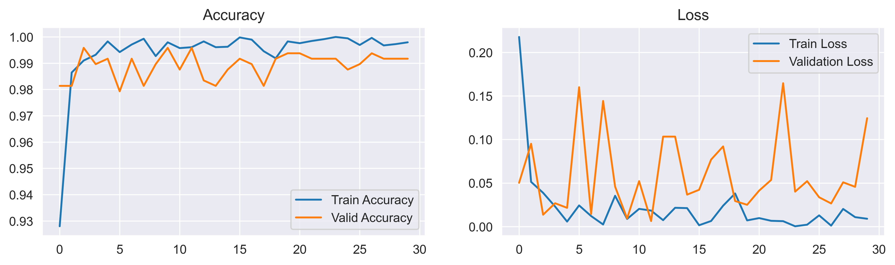
    


## <a id='step64'></a>
## <span style="background-color:orange ;background-size: cover;font-family:tahoma;font-size:70%; font-weight: 900; text-align:left;border-radius:25px 25px; padding:10px; border:solid 2px #09375b"><span style="color:navy">6.4 | Evaluation

<div style="background-color:#fbf8cc; padding: 10px 10px 10px 0px; border-radius: 10px; box-shadow: 2px 2px 4px 0 rgba(0, 0, 0, 0.1);border:0px solid #0A2342; text-align:left">
    <p style="font-size:16px; font-family:tahoma; line-height: 2em; text-indent: 20px;">🔵 After finishing training, we should test the model with never unseen images to final evaluate the model.


```python
with torch.no_grad() :
    model.eval()
    t0 = datetime.now()
    test_loss = []
    val_loss = []
    n_correct = 0
    n_total = 0

    for images, labels in test_loader :
        # Move input data to GPU
        images = images.to(device)
        labels = labels.to(device)

        # Forward pass
        y_pred = model(images)
        loss = criterion(y_pred, labels)

        # Train Loss
        test_loss.append(loss.item())

        # Train Accuracy
        _, prediction = torch.max(y_pred, 1)
        n_correct += (prediction==labels).sum().item()
        n_total += labels.shape[0]

    test_loss = np.mean(train_loss)
    train_acc = n_correct / n_total
    dt = datetime.now() - t0
    print(colored(f'Loss:{test_loss:.4f}\nAccuracy:{train_acc:.4f}\nDuration:{dt}', 'green', attrs=['bold']))
```

    Loss:0.0091
    Accuracy:0.9939
    Duration:0:00:10.539431
    

## <a id='step65'></a>
## <span style="background-color:orange ;background-size: cover;font-family:tahoma;font-size:70%; font-weight: 900; text-align:left;border-radius:25px 25px; padding:10px; border:solid 2px #09375b"><span style="color:navy">6.5 | Plot The Result

<div style="background-color:#fbf8cc; padding: 10px 10px 10px 0px; border-radius: 10px; box-shadow: 2px 2px 4px 0 rgba(0, 0, 0, 0.1);border:0px solid #0A2342; text-align:left">
    <p style="font-size:16px; font-family:tahoma; line-height: 2em; text-indent: 20px;">🔵 And now, plot some images with <b>real labels</b> and <b>predicted labels</b> .</p>
    <p style="font-size:16px; font-family:tahoma; line-height: 2em; text-indent: 20px;">🔵 To do this, we should create a Dictionary called label_map, a dictionary with indexes as keys and class_names as values. </p>


```python
# Create a label_map to show True and Predicted labels in below plot
classes.sort()
classes
labels_map = {}

for index, label in enumerate(classes) :
    labels_map[index] = label

labels_map
```


    {0: 'Benign', 1: 'Early_Pre_B', 2: 'Pre_B', 3: 'Pro_B'}


```python
# Move model to CPU
cpu_model = model.cpu()

# Get 1 batch of test_loader
for imgs, labels in test_loader :
    break

# Plot 1 batch of test_loader images with True and Predicted label
plt.subplots(4, 8, figsize=(16, 12))
plt.suptitle('Rice images in 1 Batch', fontsize=25, fontweight='bold')
for i in range(32) :
    ax = plt.subplot(4, 8, i+1)
    img = torch.permute(imgs[i], (1, 2, 0))
    plt.imshow(img)
    label = labels_map[int(labels[i])]
    img = img[i].unsqueeze(0)
    img = imgs[i].unsqueeze(0)
    out = cpu_model(img)
    predict = labels_map[int(out.argmax())]
    plt.title(f'True :{label}\nPredict :{predict}')
    plt.axis('off')

plt.show()
```


    
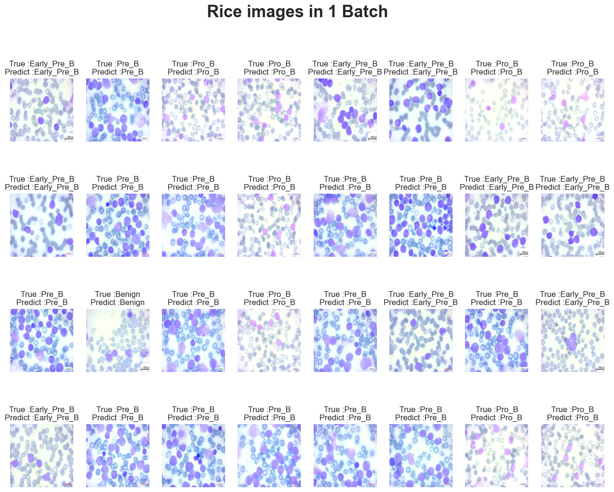
    


## <a id='step66'></a>
## <span style="background-color:orange ;background-size: cover;font-family:tahoma;font-size:70%; font-weight: 900; text-align:left;border-radius:25px 25px; padding:10px; border:solid 2px #09375b"><span style="color:navy">6.6 | Confusion Matrix

<div style="background-color:#fbf8cc; padding: 10px 10px 10px 0px; border-radius: 10px; box-shadow: 2px 2px 4px 0 rgba(0, 0, 0, 0.1);border:0px solid #0A2342; text-align:left">
    <p style="font-size:16px; font-family:tahoma; line-height: 2em; text-indent: 20px;">🔵 And the final step is ploting <b>Confusion Matrix</b> by <code>sklearn</code> library.


```python
# Get out 2 list include y_true and y_pred for use in confusion_matrix
model = model.to(device)

y_true = []
y_pred = []
for images, labels in test_loader:
    images = images.to(device)
    labels = labels.numpy()
    outputs = model(images)
    _, pred = torch.max(outputs.data, 1)
    pred = pred.detach().cpu().numpy()
    
    y_true = np.append(y_true, labels)
    y_pred = np.append(y_pred, pred)
```


```python
classes = labels_map.values()

print(classification_report(y_true, y_pred))

def plot_confusion_matrix(y_test, y_prediction):
    '''Plotting Confusion Matrix'''
    cm = confusion_matrix(y_true, y_pred)
    ax = plt.figure(figsize=(8, 6))
    ax = sns.heatmap(cm, annot=True, fmt='', cmap="Blues")
    ax.set_xlabel('Prediced labels', fontsize=18)
    ax.set_ylabel('True labels', fontsize=18)
    ax.set_title('Confusion Matrix', fontsize=25)
    ax.xaxis.set_ticklabels(classes)
    ax.yaxis.set_ticklabels(classes) 
    plt.show()


plot_confusion_matrix(y_true, y_pred)
```

                  precision    recall  f1-score   support
    
             0.0       0.99      1.00      0.99        78
             1.0       1.00      0.99      0.99       148
             2.0       0.99      1.00      1.00       144
             3.0       0.99      0.99      0.99       120
    
        accuracy                           0.99       490
       macro avg       0.99      0.99      0.99       490
    weighted avg       0.99      0.99      0.99       490
    
    


    
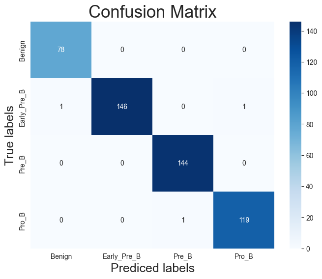
    


<a id="author"></a>
<div style="border:3px solid navy; border-radius:30px; padding: 15px; background-size: cover; font-size:120%; text-align:left; background-image: url(https://i.postimg.cc/sXwGWcwC/download.jpg); background-size: cover">

<h4 align="left"><span style="font-weight:700; font-size:150%"><font color=#d10202>Author:</font><font color=navy> Nima Pourmoradi</font></span></h4>
<h6 align="left"><font color=#ff6200><a href='https://github.com/NimaPourmoradi'>github: https://github.com/NimaPourmoradi</font></h6>
<h6 align="left"><font color=#ff6200><a href='https://www.kaggle.com/nimapourmoradi'>kaggle : https://www.kaggle.com/nimapourmoradi</a></font></h6>
<h6 align="left"><font color=#ff6200><a href='https://www.linkedin.com/in/nima-pourmoradi-081949288/'>linkedin : www.linkedin.com/in/nima-pourmoradi</a></font></h6>
<h6 align="left"><font color=#ff6200><a href='https://t.me/Nima_Pourmoradi'>Telegram : https://t.me/Nima_Pourmoradi</a></font></h6>

<div style="background-color:#c5d8d1; padding: 25px 0px 10px 0px; border-radius: 10px; box-shadow: 2px 2px 4px 0 rgba(0, 0, 0, 0.1);border:0px solid #0A2342; text-align:center">
    <p style="font-size:18px; font-family:tahoma; line-height: 2em; text-indent: 20px;"><b>✅ If you like my notebook, please upvote it ✅
    </b></p>
</div>


##### [🏠 Tabel of Contents](#tbl_content)
